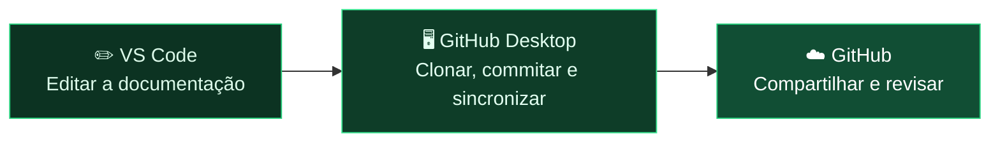
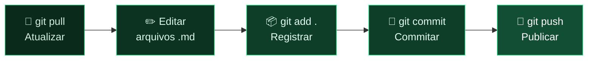

# Módulo 1 — Git para Documentação

> **Para quem é este módulo:** equipes de Produto e Engenharia que mantêm documentação em repositórios Git — sem necessidade de saber programar.
>
> **Por que este módulo vem primeiro:** antes de instalar ferramentas e editar arquivos, a equipe precisa entender o fluxo mental do trabalho com documentação versionada. Este módulo apresenta o vocabulário e o raciocínio base que serão reutilizados em toda a trilha.

!!! abstract "🎯 Objetivos de aprendizagem"
    Neste módulo você vai aprender:

    - Como Git, GitHub e VS Code se conectam no trabalho com documentação
    - Os conceitos de repositório, local/remoto, commit, clone, push e pull
    - O fluxo de trabalho diário (simplificado e completo)
    - Os comandos essenciais e quando usá-los
    - Como resolver situações comuns (conflitos, desfazer erros)

---

## 1. Mapa do ecossistema

Antes de entrar nos comandos, é importante entender quais ferramentas compõem o fluxo. Neste módulo, o caminho principal combina **VS Code** para edição com **GitHub Desktop** para as operações visuais de Git, enquanto o **GitHub** funciona como repositório remoto da equipe.

| Ferramenta | O que é | Para que serve neste contexto |
|---|---|---|
| **Git** | Sistema de controle de versão | O "motor" por baixo de tudo: rastreia cada mudança feita nos arquivos |
| **GitHub** | Plataforma na nuvem | Armazena o repositório remoto e viabiliza a colaboração entre pessoas da equipe |
| **VS Code** | Editor de texto | É onde você escreve e edita os arquivos de documentação (`.md`) |
| **GitHub Desktop** | Aplicativo visual para usar Git | É a forma principal apresentada neste módulo para clonar, sincronizar e enviar mudanças sem depender do terminal |



> **Em resumo:** você edita no **VS Code**, usa o **GitHub Desktop** para executar as operações visuais de Git, e o resultado fica armazenado no **GitHub** para compartilhamento e revisão.

---

## 2. Por que usar Git para documentação?

Git é um sistema de **controle de versão**: ele registra cada mudança feita em arquivos ao longo do tempo, permitindo que múltiplas pessoas colaborem sem sobrescrever o trabalho umas das outras.

Para documentação, isso significa:

| Situação | Sem Git | Com Git |
|---|---|---|
| Duas pessoas editam o mesmo arquivo | Uma versão sobrescreve a outra | Cada mudança é rastreada e mesclada |
| Um texto errado é publicado | Difícil saber quem mudou o quê | É possível ver quem alterou, quando e por quê — e reverter |
| Nova funcionalidade precisa de doc em rascunho | Arquivo paralelo vira bagunça | Você cria um branch isolado |
| Revisão de conteúdo antes de publicar | E-mail ou comentário no doc | Pull Request com histórico de revisão |

---

## 3. Conceitos Fundamentais

### Repositório (repo)

É a **pasta raiz do projeto**, controlada pelo Git. Cada produto tem o seu repositório:

- Visus → `visus_docs/`
- Builder → `builder_docs/`
- Eberick → `eberick_docs/`

Tudo dentro dele — arquivos Markdown, imagens, configurações — é rastreado.

Um repositório pode ser:

- **Local**: a cópia que existe na sua máquina
- **Remoto**: a cópia oficial que fica no GitHub (ou GitLab, Azure DevOps, etc.)

### Commit

Um commit é um **snapshot** — uma fotografia do estado dos arquivos em um momento específico. Cada commit tem:
- Uma **mensagem** descrevendo o que foi alterado (ex.: `docs: adiciona guia de acesso ao módulo Collab`)
- Um **autor** e **data/hora**
- Um **identificador único** (hash)

> **Analogia:** um commit é como salvar uma versão de um documento Word com um nome descritivo — mas automático, rastreável e reversível.

### Clone

**Clonar** um repositório significa baixar uma cópia completa dele (incluindo todo o histórico de commits) para a sua máquina. É a **primeira operação** que você faz — feita uma única vez por máquina.

#### Como clonar pelo GitHub Desktop (recomendado neste módulo)

O GitHub Desktop é a forma principal apresentada neste módulo para clonar um repositório sem depender do terminal. Ele deixa o fluxo inicial mais visual para quem está começando.

1. Abra o **GitHub Desktop**
2. Clique em **Add** → **Clone repository…**
3. Localize o repositório desejado (ex.: `AltoQiTec/builder_docs`)
4. Defina a pasta local onde o repositório será salvo (ex.: `C:\Repos\`)
5. Clique em **Clone**
6. Depois do download, use **Repository** → **Open in Visual Studio Code**

Depois do clone, o GitHub Desktop entrega o repositório pronto para ser aberto no VS Code e continuar o trabalho de edição.

!!! tip "Dica"
    Se o VS Code perguntar se você quer confiar na pasta aberta, escolha **Trust the authors** apenas quando estiver trabalhando em um repositório conhecido da equipe.

#### Como clonar pelo VS Code (alternativa dentro do editor)

Se você preferir fazer tudo dentro do editor, também é possível clonar diretamente pelo VS Code:

1. Abra o **VS Code**
2. Pressione `Ctrl+Shift+P` para abrir a **Command Palette**
3. Execute o comando **Git: Clone**
4. Cole a URL do repositório
5. Escolha a pasta local onde ele será salvo
6. Aguarde o download e clique em **Open**

Depois do clone, o próprio VS Code abre o repositório para continuar o trabalho.

#### Como clonar pelo terminal (alternativa)

Se preferir usar o terminal, navegue primeiro até a pasta onde quer salvar o repositório e execute:

```bash
cd C:\Repos
git clone https://github.com/altoqi/visus-docs.git
# resultado: C:\Repos\visus-docs\
```

#### O que acontece quando você clona

Em ambos os casos, o Git cria uma **nova pasta** com o nome do repositório dentro do diretório escolhido. Por exemplo, se você escolher `C:\Repos\`, a estrutura resultante será:

```
C:\Repos\                     ← pasta que você escolheu
└── visus-docs\               ← pasta criada pelo Git (o repositório local)
    ├── .git\                 ← histórico e metadados do Git (não mexa aqui)
    ├── docs\
    ├── mkdocs.yml
    └── ...
```

#### Onde clonar — escolha uma pasta dedicada

Crie uma pasta simples para guardar todos os seus repositórios, por exemplo:

```
C:\Repos\          (Windows)
C:\Dev\            (Windows)
```

??? warning "Nunca coloque um repositório dentro de outro"
    O Git rastreia tudo que está dentro da pasta do repositório. Se você clonar um projeto dentro da pasta de outro repositório existente, o Git pai vai começar a enxergar o repositório filho como arquivos não rastreados — causando confusão e erros difíceis de diagnosticar.

    ```
    ❌  C:\Repos\visus-docs\          ← repositório A
                  └── curso_github\   ← repositório B clonado aqui dentro → PROBLEMA

    ✅  C:\Repos\visus-docs\          ← repositório A
        C:\Repos\curso_github\        ← repositório B na mesma pasta pai → CORRETO
    ```

    **Exceção:** repositórios aninhados de forma intencional existem (chamados de *git submodules*), mas são uma configuração avançada que nunca acontece por acidente — exige um comando específico.

---

## 4. Fluxo de Trabalho Diário

Existem dois fluxos possíveis. Comece pelo simplificado e migre para o completo quando a equipe crescer ou quando a documentação precisar de revisão antes de publicar.

---

### Fluxo Simplificado — todos trabalham direto no `main`

**Quando usar:** equipe pequena (2–3 pessoas), confiança mútua no conteúdo, sem necessidade de revisão formal antes de publicar. É o ponto de partida natural para quem está aprendendo.



1. **git pull** — baixa as alterações mais recentes do repositório remoto para a sua máquina
2. **Editar arquivos .md** — abre e edita os arquivos de documentação no VS Code
3. **git add .** — marca todos os arquivos alterados para entrarem no próximo commit
4. **git commit** — salva um snapshot das mudanças com uma mensagem descritiva
5. **git push** — envia os commits locais para o repositório remoto (e aciona a publicação)

!!! warning "Atenção"
    No fluxo simplificado, o que você faz `push` vai direto para produção. Revise bem antes de commitar.

---

### Fluxo Completo — branches e Pull Requests

**Quando usar:** equipe maior, conteúdo que precisa de revisão antes de publicar, trabalhos longos em paralelo (ex.: um redator documenta o módulo Planning enquanto outro atualiza o Collab), ou quando erros no main causariam problemas visíveis para usuários do site.

O fluxo completo adiciona duas etapas entre o commit e a publicação: um **branch isolado** e um **Pull Request** com revisão. Para entender em detalhe o que são e como funcionam, veja o documento complementar: [04 — Branches e Pull Requests](./04-branches-e-pull-requests.md).

```mermaid
flowchart LR
    A["🔄 git pull\nAtualizar"] --> B["🌿 checkout -b\nCriar branch"] --> C["✏️ Editar\narquivos .md"] --> D["📦 git add .\nRegistrar"]
    D --> E["💾 git commit\nCommitar"] --> F["🚀 git push\nEnviar branch"]
    F --> G["🔍 Pull Request\nRevisar"] --> H["✅ Merge\nPublicar"]
    style A fill:#0a2a1c,stroke:#1aa863,color:#d4ede0
    style B fill:#0e3a30,stroke:#34d399,color:#dafff2
    style C fill:#0c3322,stroke:#25CE7B,color:#dcfaea
    style D fill:#0e3d28,stroke:#3BE592,color:#e3fff1
    style E fill:#0e3d28,stroke:#3BE592,color:#e3fff1
    style F fill:#114e34,stroke:#25CE7B,color:#ffffff
    style G fill:#3a3408,stroke:#facc15,color:#fff6cf
    style H fill:#155f3f,stroke:#3BE592,color:#ffffff
```



As etapas de editar, `git add`, `git commit` e `git push` são as mesmas do fluxo simplificado. As duas etapas adicionais são:

1. **checkout -b** — cria um branch isolado antes de começar a editar, para que as mudanças não afetem o `main` diretamente
2. **Pull Request + Merge** — abre uma solicitação de revisão no GitHub; só após a aprovação o conteúdo é mesclado ao `main` e publicado

---

## 5. Comandos Essenciais

> **Não é preciso decorar os comandos.** O que importa é entender o *conceito* de cada operação — o que ela faz e quando usar. Na prática do dia a dia, você vai executar a maioria dessas ações pelos botões do VS Code, sem digitar nada no terminal. Veja a seção [4. Git integrado no VS Code](./02-vscode-e-copilot.md#4-git-integrado-no-vs-code) do Módulo 2 para conhecer a interface visual.

---

### `git pull` — Atualizar seu repositório local

```bash
git pull
```

> **Sempre faça isso antes de começar a trabalhar.** Garante que você está partindo da versão mais recente.

**Alternativa no VS Code:** no painel **Source Control** (`Ctrl+Shift+G`), clique em **...** → **Pull**. Ou clique no ícone de sincronização (⇅) na barra de status inferior.

---

### `git status` — Ver o que foi alterado

```bash
git status
```

Mostra os arquivos modificados, novos ou deletados desde o último commit.

**Alternativa no VS Code:** abra o painel **Source Control** (`Ctrl+Shift+G`). Todos os arquivos alterados aparecem listados automaticamente em **Changes**, com ícones que indicam se foram modificados (M), adicionados (U) ou deletados (D).

---

### `git add` — Preparar arquivos para o commit

```bash
git add docs/collab/introducao.md      # arquivo específico
git add docs/collab/                   # uma pasta inteira
git add .                              # tudo que foi alterado
```

**Alternativa no VS Code:** no painel **Source Control**, clique no **+** ao lado de um arquivo específico para fazer stage dele. Para adicionar tudo de uma vez, clique no **+** ao lado do título **Changes**.

---

### `git commit` — Registrar as alterações

```bash
git commit -m "docs: adiciona introdução ao módulo Collab"
```

**Alternativa no VS Code:** no painel **Source Control**, digite a mensagem do commit no campo de texto no topo e clique em **Commit** (✓).

**Convenção de mensagens de commit** (recomendada):

| Prefixo | Quando usar |
|---------|-------------|
| `docs:` | Criação ou atualização de conteúdo de documentação |
| `fix:` | Correção de erro (link quebrado, informação errada) |
| `refactor:` | Reorganização de estrutura sem mudar o conteúdo |
| `chore:` | Alterações de configuração (mkdocs.yml, requirements.txt) |

---

### `git push` — Enviar para o repositório remoto

No **fluxo simplificado** (direto no main):

```bash
git push
```

No **fluxo completo** (branch dedicado) — veja [04 — Branches e Pull Requests](./04-branches-e-pull-requests.md):

```bash
git push origin docs/guia-collab
```

**Alternativa no VS Code:** no painel **Source Control**, clique em **...** → **Push**. O botão **Sync Changes** (⇅ na barra de status) faz `pull` + `push` em sequência, sendo a opção mais prática no dia a dia.

#### Como verificar que o push foi bem-sucedido

Após executar o `push`, acesse o repositório no GitHub pelo navegador:

1. Vá para **`github.com/<organização>/<repositório>`** (ex.: `github.com/AltoQiTec/builder_docs`)
2. O branch em que você está trabalhando aparece no seletor de branches — certifique-se de que o branch correto está selecionado
3. Navegue até a pasta/arquivo que você adicionou ou editou
4. Confirme que:
   - o arquivo aparece na listagem de arquivos
   - a **mensagem do seu commit** aparece ao lado do nome do arquivo
   - a **data/hora** corresponde ao seu push mais recente

> **Dica:** o terminal também confirma o sucesso do push com uma saída como:
> ```
> To https://github.com/AltoQiTec/builder_docs.git
>    a1b2c3d..e4f5g6h  main -> main
> ```
> Se aparecer um erro (ex.: `rejected`), é sinal de que há commits remotos que você ainda não baixou — execute `git pull` antes de tentar o push novamente.

---

### `git log` — Ver o histórico de commits

```bash
git log --oneline --graph
```

**Alternativa no VS Code:** abra o painel **Timeline** (visível na parte inferior do explorador de arquivos) para ver o histórico do arquivo aberto. Para o histórico completo do repositório, use **...** → **View History** no painel Source Control.

---

## 6. Situações Comuns

!!! tip "Conflitos são raros"
    Se a equipe sempre faz `git pull` antes de começar a trabalhar, conflitos quase nunca acontecem. As situações abaixo são para quando eles ocorrem.

### "Alguém atualizou o arquivo que eu também editei"

Isso gera um **conflito de merge**. O Git marca as diferenças no arquivo:

```
<<<<<<< HEAD
Texto que está no seu branch
=======
Texto que está no main
>>>>>>> main
```

Você precisa editar o arquivo manualmente, escolhendo qual versão manter (ou combinando as duas), e depois fazer um novo commit. O VS Code tem uma interface visual para resolver conflitos.

#### Walkthrough passo a passo: resolvendo um conflito no VS Code

**Situação:** você e um colega editaram o mesmo parágrafo do arquivo `docs/visao-geral.md` e agora, ao fazer `git pull`, o Git informa conflito.

---

**Passo 1 — Identificar o conflito**

O painel **Source Control** (`Ctrl+Shift+G`) exibe o arquivo com o ícone **C** (Conflict). Clique nele para abri-lo.

```
SOURCE CONTROL
  Merge Changes
    C  docs/visao-geral.md
```

---

**Passo 2 — Entender as marcações no arquivo**

O arquivo aberto mostrará algo como:

```
<<<<<<< HEAD (Current Change)
O AltoQi Visus é uma plataforma de gestão de obras baseada em BIM.
=======
O AltoQi Visus é um ambiente colaborativo para gestão de projetos BIM.
>>>>>>> origin/main (Incoming Change)
```

| Marcação | O que significa |
|---|---|
| `<<<<<<< HEAD` | Início da sua versão (local) |
| `=======` | Separador entre as duas versões |
| `>>>>>>> origin/main` | Fim da versão que veio do repositório remoto |

---

**Passo 3 — Escolher a resolução usando os botões do VS Code**

O VS Code exibe quatro botões diretamente acima do bloco de conflito no editor:

| Botão | O que faz |
|---|---|
| **Accept Current Change** | Mantém sua versão, descarta a do colega |
| **Accept Incoming Change** | Mantém a versão do colega, descarta a sua |
| **Accept Both Changes** | Insere as duas versões, uma após a outra |
| **Compare Changes** | Abre diff lado a lado para decidir com mais cuidado |

!!! tip "Na dúvida, use Compare Changes"
    O diff lado a lado facilita entender o que cada pessoa mudou antes de decidir qual versão manter — ou como combinar as duas manualmente.

---

**Passo 4 — Editar manualmente se necessário**

Se nenhum dos botões atende (por exemplo, você quer combinar partes das duas versões), apague as marcações `<<<<<<<`, `=======` e `>>>>>>>` manualmente e deixe o texto como deve ficar. O resultado final deve ser um arquivo limpo, sem nenhum marcador do Git.

!!! warning "Nunca commite com marcadores de conflito"
    Se o arquivo ainda contiver `<<<<<<< HEAD` ou `=======`, o conteúdo publicado ficará corrompido. Revise o arquivo inteiro antes de fazer o commit.

---

**Passo 5 — Fazer stage e commit da resolução**

Após salvar o arquivo resolvido:

1. No painel **Source Control**, clique em {: .vscode-icon} ao lado do arquivo para fazer stage
2. Clique em {: .vscode-icon} **Commit** (a mensagem sugerida `Merge branch 'origin/main'` já está preenchida)
3. Clique em **Sync Changes** para enviar o commit de merge

O conflito está resolvido. O histórico registrará que houve um merge e quem o resolveu.

---

### "Cometi um erro e quero desfazer antes de commitar"

```bash
git checkout -- docs/arquivo-errado.md   # descarta mudanças não commitadas
```

---

### "Já commitei algo errado"

```bash
git revert HEAD    # cria um novo commit que desfaz o último
```

> Não use `git reset --hard` sem entender o impacto — ele pode apagar commits irreversivelmente.

---

??? note "Glossário Rápido"
    | Termo | Significado |
    |---|---|
    | **Repository (repo)** | Pasta do projeto gerenciada pelo Git |
    | **Clone** | Baixar uma cópia completa do repositório para sua máquina |
    | **Commit** | Snapshot dos arquivos com mensagem descritiva |
    | **Push** | Enviar commits locais para o repositório remoto |
    | **Pull** | Baixar e integrar commits do repositório remoto |
    | **main** | Branch principal (produção) |
    | **Branch / PR** | Conceitos do fluxo completo — ver [04 — Branches e Pull Requests](./04-branches-e-pull-requests.md) |

---

!!! success "✅ Resumo do módulo"
    Git versiona sua documentação e evita que o trabalho de uma pessoa sobrescreva o de outra. Você viu como **Git, GitHub e VS Code** se conectam, aprendeu os conceitos de **repositório, commit, clone, push e pull**, entendeu o fluxo diário (`pull` → editar → `add` → `commit` → `push`) e viu como lidar com conflitos e desfazer erros. Na prática, a trilha assume o **VS Code como ambiente principal** para executar esse fluxo.

---

> **Leitura complementar:** [04 — Branches e Pull Requests](./04-branches-e-pull-requests.md) — aprofundamento do fluxo completo  
> **Próximo módulo:** [02 — VS Code e GitHub Copilot](./02-vscode-e-copilot.md)
