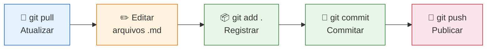

# Módulo 1 — Git para Documentação

> **Para quem é este módulo:** equipes de Produto e Engenharia que mantêm documentação em repositórios Git — sem necessidade de saber programar.

**Neste módulo você vai aprender:**

- O que é Git e por que usá-lo para documentação
- Os conceitos de repositório, commit, clone, push e pull
- O fluxo de trabalho diário (simplificado e completo)
- Os comandos essenciais e quando usá-los
- Como resolver situações comuns (conflitos, desfazer erros)

---

## 1. Por que usar Git para documentação?

Git é um sistema de **controle de versão**: ele registra cada mudança feita em arquivos ao longo do tempo, permitindo que múltiplas pessoas colaborem sem sobrescrever o trabalho umas das outras.

Para documentação, isso significa:

| Situação | Sem Git | Com Git |
|---|---|---|
| Duas pessoas editam o mesmo arquivo | Uma versão sobrescreve a outra | Cada mudança é rastreada e mesclada |
| Um texto errado é publicado | Difícil saber quem mudou o quê | É possível ver quem alterou, quando e por quê — e reverter |
| Nova funcionalidade precisa de doc em rascunho | Arquivo paralelo vira bagunça | Você cria um branch isolado |
| Revisão de conteúdo antes de publicar | E-mail ou comentário no doc | Pull Request com histórico de revisão |

---

## 2. Conceitos Fundamentais

### Repositório (repo)

É a **pasta raiz do projeto**, controlada pelo Git. No caso da documentação do Visus, o repositório é `visus_docs/`. Tudo dentro dele — arquivos Markdown, imagens, configurações — é rastreado.

Um repositório pode ser:
- **Local**: a cópia que existe na sua máquina
- **Remoto**: a cópia oficial que fica no GitHub (ou GitLab, Azure DevOps, etc.)

### Commit

Um commit é um **snapshot** — uma fotografia do estado dos arquivos em um momento específico. Cada commit tem:
- Uma **mensagem** descrevendo o que foi alterado (ex.: `docs: adiciona guia de acesso ao módulo Collab`)
- Um **autor** e **data/hora**
- Um **identificador único** (hash)

> **Analogia:** um commit é como salvar uma versão de um documento Word com um nome descritivo — mas automático, rastreável e reversível.

### Clone

**Clonar** um repositório significa baixar uma cópia completa dele (incluindo todo o histórico de commits) para a sua máquina. É a **primeira operação** que você faz — feita uma única vez por máquina.

#### O que acontece quando você clona

O Git cria uma **nova pasta** com o nome do repositório dentro do diretório onde você executou o comando. Por exemplo, se você estiver em `C:\Projetos\` e clonar o repositório `visus-docs`, a estrutura resultante será:

```
C:\Projetos\                  ← pasta onde você executou o clone
└── visus-docs\               ← pasta criada pelo Git (o repositório local)
    ├── .git\                 ← histórico e metadados do Git (não mexa aqui)
    ├── docs\
    ├── mkdocs.yml
    └── ...
```

O comando:

```bash
git clone https://github.com/altoqi/visus-docs.git
```

deve ser executado **dentro da pasta onde você quer que o repositório fique** — não dentro de outra pasta de repositório já existente.

#### Onde clonar — escolha uma pasta dedicada

Crie uma pasta simples para guardar seus repositórios, por exemplo:

```
C:\Repos\          (Windows)
C:\Dev\            (Windows)
~/repos/           (macOS/Linux)
```

Então navegue até ela antes de clonar:

```bash
cd C:\Repos
git clone https://github.com/altoqi/visus-docs.git
# resultado: C:\Repos\visus-docs\
```

??? warning "Nunca coloque um repositório dentro de outro"
    O Git rastreia tudo que está dentro da pasta do repositório. Se você clonar um projeto dentro da pasta de outro repositório existente, o Git pai vai começar a enxergar o repositório filho como arquivos não rastreados — causando confusão e erros difíceis de diagnosticar.

    ```
    ❌  C:\Repos\visus-docs\          ← repositório A
                  └── curso_github\   ← repositório B clonado aqui dentro → PROBLEMA

    ✅  C:\Repos\visus-docs\          ← repositório A
        C:\Repos\curso_github\        ← repositório B na mesma pasta pai → CORRETO
    ```

    **Exceção:** repositórios aninhados de forma intencional existem (chamados de *git submodules*), mas são uma configuração avançada que nunca acontece por acidente — exige um comando específico.

---

## 3. Fluxo de Trabalho Diário

Existem dois fluxos possíveis. Comece pelo simplificado e migre para o completo quando a equipe crescer ou quando a documentação precisar de revisão antes de publicar.

---

### Fluxo Simplificado — todos trabalham direto no `main`

**Quando usar:** equipe pequena (2–3 pessoas), confiança mútua no conteúdo, sem necessidade de revisão formal antes de publicar. É o ponto de partida natural para quem está aprendendo.



!!! warning "Atenção"
    No fluxo simplificado, o que você faz `push` vai direto para produção. Revise bem antes de commitar.

---

### Fluxo Completo — branches e Pull Requests

**Quando usar:** equipe maior, conteúdo que precisa de revisão antes de publicar, trabalhos longos em paralelo (ex.: um redator documenta o módulo Planning enquanto outro atualiza o Collab), ou quando erros no main causariam problemas visíveis para usuários do site.

O fluxo completo adiciona duas etapas entre o commit e a publicação: um **branch isolado** e um **Pull Request** com revisão. Para entender em detalhe o que são e como funcionam, veja o documento complementar: [05 — Branches e Pull Requests](./05-branches-e-pull-requests.md).

```mermaid
flowchart LR
    A["🔄 git pull\nAtualizar"] --> B["🌿 checkout -b\nCriar branch"] --> C["✏️ Editar\narquivos .md"] --> D["📦 git add .\nRegistrar"]
    D --> E["💾 git commit\nCommitar"] --> F["🚀 git push\nEnviar branch"]
    F --> G["🔍 Pull Request\nRevisar"] --> H["✅ Merge\nPublicar"]
    style A fill:#e3f2fd,stroke:#1565c0
    style B fill:#f3e5f5,stroke:#7b1fa2
    style C fill:#fff3e0,stroke:#ef6c00
    style D fill:#e8f5e9,stroke:#2e7d32
    style E fill:#e8f5e9,stroke:#2e7d32
    style F fill:#fce4ec,stroke:#c62828
    style G fill:#fff9c4,stroke:#f9a825
    style H fill:#c8e6c9,stroke:#2e7d32
```



---

## 4. Comandos Essenciais

> **Não é preciso decorar os comandos.** O que importa é entender o *conceito* de cada operação — o que ela faz e quando usar. Na prática do dia a dia, você vai executar a maioria dessas ações pelos botões do VS Code, sem digitar nada no terminal. Veja a seção [4. Git integrado no VS Code](./03-vscode-e-copilot.md#4-git-integrado-no-vs-code) do Módulo 3 para conhecer a interface visual.

---

### `git pull` — Atualizar seu repositório local

```bash
git pull
```

> **Sempre faça isso antes de começar a trabalhar.** Garante que você está partindo da versão mais recente.

---

### `git status` — Ver o que foi alterado

```bash
git status
```

Mostra os arquivos modificados, novos ou deletados desde o último commit.

---

### `git add` — Preparar arquivos para o commit

```bash
git add docs/collab/introducao.md      # arquivo específico
git add docs/collab/                   # uma pasta inteira
git add .                              # tudo que foi alterado
```

---

### `git commit` — Registrar as alterações

```bash
git commit -m "docs: adiciona introdução ao módulo Collab"
```

**Convenção de mensagens de commit** (recomendada):

| Prefixo | Quando usar |
|---------|-------------|
| `docs:` | Criação ou atualização de conteúdo de documentação |
| `fix:` | Correção de erro (link quebrado, informação errada) |
| `refactor:` | Reorganização de estrutura sem mudar o conteúdo |
| `chore:` | Alterações de configuração (mkdocs.yml, requirements.txt) |

---

### `git push` — Enviar para o repositório remoto

No **fluxo simplificado** (direto no main):

```bash
git push
```

No **fluxo completo** (branch dedicado) — veja [05 — Branches e Pull Requests](./05-branches-e-pull-requests.md):

```bash
git push origin docs/guia-collab
```

---

### `git log` — Ver o histórico de commits

```bash
git log --oneline --graph
```

---

## 5. Situações Comuns

!!! tip "Conflitos são raros"
    Se a equipe sempre faz `git pull` antes de começar a trabalhar, conflitos quase nunca acontecem. As situações abaixo são para quando eles ocorrem.

### "Alguém atualizou o arquivo que eu também editei"

Isso gera um **conflito de merge**. O Git marca as diferenças no arquivo:

```
<<<<<<< HEAD
Texto que está no seu branch
=======
Texto que está no main
>>>>>>> main
```

Você precisa editar o arquivo manualmente, escolhendo qual versão manter (ou combinando as duas), e depois fazer um novo commit. O VS Code tem uma interface visual para resolver conflitos.

---

### "Cometi um erro e quero desfazer antes de commitar"

```bash
git checkout -- docs/arquivo-errado.md   # descarta mudanças não commitadas
```

---

### "Já commitei algo errado"

```bash
git revert HEAD    # cria um novo commit que desfaz o último
```

> Não use `git reset --hard` sem entender o impacto — ele pode apagar commits irreversivelmente.

---

??? note "Glossário Rápido"
    | Termo | Significado |
    |---|---|
    | **Repository (repo)** | Pasta do projeto gerenciada pelo Git |
    | **Clone** | Baixar uma cópia completa do repositório para sua máquina |
    | **Commit** | Snapshot dos arquivos com mensagem descritiva |
    | **Push** | Enviar commits locais para o repositório remoto |
    | **Pull** | Baixar e integrar commits do repositório remoto |
    | **main** | Branch principal (produção) |
    | **Branch / PR** | Conceitos do fluxo completo — ver [05 — Branches e Pull Requests](./05-branches-e-pull-requests.md) |

---

> **Leitura complementar:** [05 — Branches e Pull Requests](./05-branches-e-pull-requests.md) — aprofundamento do fluxo completo  
> **Próximo módulo:** [02 — Markdown e MkDocs](./02-markdown-e-mkdocs.md)
