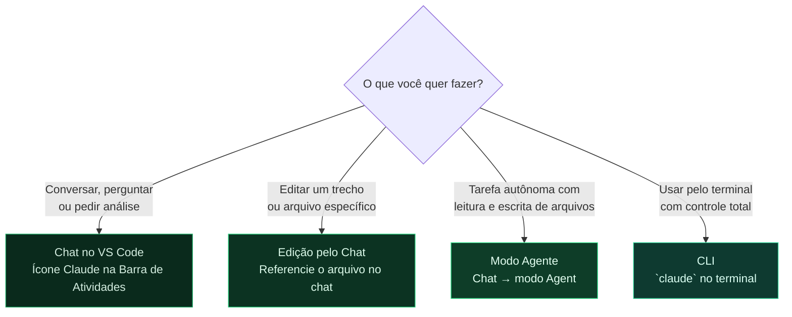

# Módulo 2 — VS Code e Claude Code para Documentação

> **Para quem é este módulo:** toda a equipe que vai escrever documentação no VS Code com apoio de IA.
>
> **Por que este módulo vem agora:** com o fluxo geral de Git já explicado, o próximo passo é preparar o ambiente real de trabalho. Aqui a equipe instala as ferramentas, abre o repositório e aprende a operar o dia a dia pela interface do VS Code.

!!! abstract "🎯 Objetivos de aprendizagem"
    Neste módulo você vai aprender:

    - Quais programas instalar primeiro para começar a trabalhar
    - Por que usar o VS Code como editor de documentação
    - Como configurar o ambiente (Git, Python, VS Code, extensões, preview e terminal)
    - Todos os comandos Git pelo VS Code (sem terminal)
    - Os modos de uso do Claude Code e quando usar cada um
    - Boas práticas para IA generativa em documentação

---

## 1. Por que VS Code para documentação?

O VS Code (Visual Studio Code) é um editor de código gratuito da Microsoft, mas funciona igualmente bem para escrever documentação em Markdown. As vantagens para equipes de documentação:

- **Preview de Markdown em tempo real** — você vê o resultado enquanto escreve
- **Integração nativa com Git** — commit, push, pull, resolução de conflitos sem usar terminal
- **Claude Code integrado** — IA que sugere, revisa e gera conteúdo
- **Extensões úteis** — spell check, formatação automática, preview do MkDocs
- **Terminal embutido** — para rodar `mkdocs serve` sem sair do editor

---

## 2. Configuração inicial do ambiente

Este é o módulo de **setup** da trilha. Ao final desta seção, você deve ter tudo instalado e funcionando para conseguir clonar o repositório, abrir a documentação e visualizar o site localmente.

### 2.1 Instalar o Git

Baixe em [https://git-scm.com](https://git-scm.com) e instale com as opções padrão.

Depois da instalação, abra um terminal e verifique:

```bash
git --version
```

Se um número de versão aparecer, o Git está pronto para uso.

### 2.2 Instalar o Python

Baixe em [https://www.python.org](https://www.python.org) a versão 3.10 ou superior.

Durante a instalação no Windows, marque a opção para adicionar o Python ao `PATH`. Depois confirme no terminal:

```bash
python --version
```

Se sua máquina usar o Python Launcher, o comando também pode ser:

```bash
py --version
```

### 2.3 Instalar o VS Code

Baixe em [https://code.visualstudio.com](https://code.visualstudio.com) e instale normalmente.

### 2.4 Instalar as extensões recomendadas

Instale pelo painel de extensões (clique em {: .vscode-icon} na Barra de Atividades, ou `Ctrl+Shift+X`):

| Extensão | ID | Para que serve |
|---|---|---|
| **Claude Code** | `Anthropic.claude-code` | Chat de IA, edição guiada e modo agente |
| **Markdown All in One** | `yzhang.markdown-all-in-one` | Atalhos, preview, sumário automático |
| **markdownlint** | `DavidAnson.vscode-markdownlint` | Valida a formatação do Markdown |
| **Code Spell Checker** | `streetsidesoftware.code-spell-checker` | Verificação ortográfica |
| **Brazilian Portuguese** | `streetsidesoftware.code-spell-checker-portuguese-brazilian` | Dicionário PT-BR |
| **Git Graph** | `mhutchie.git-graph` | Visualização do histórico de branches |

### 2.5 Clonar e abrir o repositório

Se o repositório ainda não estiver na sua máquina, use `Ctrl+Shift+P` → **Git: Clone** e siga o fluxo descrito no Módulo 1.

No VS Code: `File → Open Folder` → selecione a pasta do repositório clonado (ex.: `visus_docs/`).

### 2.6 Instalar as dependências do projeto

Com o repositório já aberto no VS Code, abra o terminal integrado e execute:

```bash
pip install -r requirements.txt
```

Isso instala o MkDocs e os plugins usados pelo projeto.

!!! tip "Checklist rápido de setup"
    Antes de seguir para os próximos tópicos, confirme:

    - `git --version` funciona
    - `python --version` ou `py --version` funciona
    - o repositório está aberto no VS Code
    - as extensões principais foram instaladas
    - `pip install -r requirements.txt` terminou sem erro

---

## 3. Preview de Markdown

Clique no ícone {: .vscode-icon} no canto superior direito do editor para abrir o preview ao lado, ou pressione `Ctrl+Shift+V`.

**Dica:** use `Ctrl+K V` para abrir o preview em coluna separada, editando e visualizando ao mesmo tempo.

---

## 4. Git integrado no VS Code

O VS Code tem uma interface visual completa para Git — sem precisar do terminal para operações do dia a dia. Esta seção explica cada comando Git apresentado no [Módulo 1](./01-git-para-documentacao.md), mostrando tanto o comando de terminal quanto o equivalente visual no VS Code.

---

### `git clone` — Baixar o repositório pela primeira vez

```bash
git clone https://github.com/altoqi/visus-docs.git
```

Cria uma cópia local completa do repositório remoto, incluindo todo o histórico de commits. É feito **uma única vez por máquina**.

**No VS Code:** `Ctrl+Shift+P` → `Git: Clone` → cole a URL do repositório → escolha a pasta de destino.

---

### `git pull` — Atualizar seu repositório local

```bash
git pull
```

Baixa os commits mais recentes do repositório remoto e integra ao seu branch local. **Sempre execute antes de começar a trabalhar** para evitar conflitos desnecessários.

**No VS Code:** Painel {: .vscode-icon} Source Control (`Ctrl+Shift+G`) → menu {: .vscode-icon} → **Pull**.  
Ou clique em {: .vscode-icon} **Sync Changes** na barra de status inferior (sincroniza pull + push).

---

### `git status` — Ver o que foi alterado

```bash
git status
```

Lista os arquivos modificados, adicionados ou deletados desde o último commit, indicando o que está preparado para commit e o que ainda não está.

**No VS Code:** o Painel {: .vscode-icon} Source Control (`Ctrl+Shift+G`) exibe isso continuamente e de forma visual — arquivos com `M` (modified), `U` (untracked), `D` (deleted) ao lado de cada nome.

---

### `git add` — Preparar arquivos para o commit

```bash
git add docs/collab/introducao.md      # arquivo específico
git add docs/collab/                   # uma pasta inteira
git add .                              # tudo que foi alterado
```

Move os arquivos para a **staging area**: uma área intermediária onde você decide exatamente o que vai entrar no próximo commit. Um commit só inclui o que foi adicionado com `git add`.

**No VS Code:** Painel {: .vscode-icon} Source Control → clique em {: .vscode-icon} ao lado de cada arquivo em "Changes" para fazer stage. Para adicionar tudo de uma vez, clique em {: .vscode-icon} ao lado do título "Changes".

---

### `git commit` — Registrar as alterações

```bash
git commit -m "docs: adiciona introdução ao módulo Collab"
```

Cria um snapshot permanente dos arquivos que estão na staging area, com uma mensagem descritiva. O commit existe apenas no repositório **local** até que você faça `git push`.

**Convenção de mensagens:**

| Prefixo | Quando usar |
|---|---|
| `docs:` | Criação ou atualização de conteúdo |
| `fix:` | Correção de erro (link quebrado, informação errada) |
| `refactor:` | Reorganização sem mudar conteúdo |
| `chore:` | Alterações de configuração (mkdocs.yml, etc.) |

**No VS Code:** Painel {: .vscode-icon} Source Control → escreva a mensagem no campo de texto → pressione `Ctrl+Enter` ou clique em {: .vscode-icon} **Commit**.

---

### `git push` — Enviar para o repositório remoto

No **fluxo simplificado** (direto no `main`):
```bash
git push
```

No **fluxo completo** (branch dedicado):
```bash
git push origin docs/guia-collab
```

Envia seus commits locais para o repositório remoto. No fluxo simplificado, isso publica diretamente. No fluxo completo, apenas sobe o branch — a publicação acontece só após o merge do Pull Request.

**No VS Code:** Painel {: .vscode-icon} Source Control → clique em {: .vscode-icon} **Sync Changes** (faz pull + push) ou menu {: .vscode-icon} → **Push**.

---

### `git checkout -b` — Criar e entrar em um novo branch

```bash
git checkout -b docs/nome-da-tarefa
```

Cria um novo branch a partir do estado atual e já muda para ele. Usado no início do **fluxo completo** para isolar o trabalho do `main`. O nome deve descrever a tarefa (ex.: `docs/modulo-bid`, `fix/link-quebrado-collab`).

**No VS Code:** clique em {: .vscode-icon} **nome do branch** na barra de status inferior (canto esquerdo) → selecione **Create new branch...** → digite o nome.

---

### `git log` — Ver o histórico de commits

```bash
git log --oneline --graph
```

Exibe o histórico de commits em formato compacto (uma linha por commit) com um grafo ASCII mostrando a estrutura de branches. Útil para entender o que foi feito e por quem.

**No VS Code:** com a extensão **Git Graph** instalada, clique em {: .vscode-icon} **Git Graph** na barra de status inferior para ver o histórico de forma visual, com branches coloridos e detalhes de cada commit ao clicar.

---

### `git checkout -- arquivo` — Descartar mudanças não commitadas

```bash
git checkout -- docs/arquivo-errado.md
```

Descarta todas as alterações feitas no arquivo desde o último commit, restaurando-o para o estado salvo. **Atenção: irreversível** — o que foi alterado e não commitado é perdido.

**No VS Code:** Painel {: .vscode-icon} Source Control → clique com o botão direito no arquivo → **Discard Changes**.

---

### `git revert` — Desfazer um commit já registrado

```bash
git revert HEAD
```

Cria um **novo commit** que desfaz as mudanças do commit anterior. É a forma segura de reverter algo que já foi commitado, porque preserva o histórico.

> Prefira `git revert` a `git reset --hard`, que apaga commits de forma irreversível e pode causar problemas para outros colaboradores.

**No VS Code:** Painel {: .vscode-icon} Source Control → extensão **Git Graph** → clique com o botão direito no commit que quer desfazer → **Revert**.

---

### Resolver conflitos visualmente

Quando dois colaboradores editam o mesmo trecho de um arquivo, o Git gera um **conflito de merge**. O VS Code exibe os dois lados com botões de resolução:

- **Accept Current Change** — mantém o que está no seu branch
- **Accept Incoming Change** — mantém o que veio do remoto
- **Accept Both Changes** — mantém os dois trechos
- **Compare Changes** — mostra o diff lado a lado

Após resolver todos os conflitos, faça `git add` nos arquivos resolvidos e depois `git commit` para finalizar o merge.

---

### Resumo: comandos × VS Code

| Comando | O que faz | Ícone / Botão no VS Code | Atalho / Ação |
|---|---|---|---|
| `git clone` | Baixa o repositório | — | `Ctrl+Shift+P` → Git: Clone |
| `git pull` | Atualiza do remoto | {: .vscode-icon} Sync Changes | {: .vscode-icon} → Pull |
| `git status` | Lista arquivos alterados | {: .vscode-icon} Source Control | `Ctrl+Shift+G` |
| `git add` | Prepara para commit | {: .vscode-icon} ao lado do arquivo | — |
| `git commit -m` | Salva o snapshot | {: .vscode-icon} Commit | `Ctrl+Enter` |
| `git push` | Envia ao remoto | {: .vscode-icon} Sync Changes | {: .vscode-icon} → Push |
| `git checkout -b` | Cria branch | {: .vscode-icon} barra de status | — |
| `git log` | Histórico de commits | {: .vscode-icon} Git Graph | barra de status |
| `git checkout -- arquivo` | Descarta mudanças | — | Discard Changes (botão direito) |
| `git revert HEAD` | Desfaz último commit | — | Git Graph → Revert |

---

## 5. O que é o Claude Code?

!!! warning "Acesso necessário"
    O Claude Code requer acesso ao serviço Anthropic (via API key individual ou configurada pela organização). Consulte seu gestor para verificar se sua conta já tem acesso configurado.

O Claude Code é um **assistente de IA desenvolvido pela Anthropic**, disponível como extensão do VS Code e como ferramenta de linha de comando (CLI). Diferente de IAs de sugestão inline, o Claude Code opera como um **agente**: ele lê o contexto completo do repositório, edita arquivos diretamente e executa tarefas de múltiplos passos de forma autônoma.

O Claude Code pode:

- **Entender o repositório inteiro** antes de responder — lê estrutura, histórico e conteúdo
- **Gerar rascunhos** de páginas de documentação a partir de uma instrução
- **Editar arquivos diretamente**, com confirmação explícita do usuário antes de cada alteração
- **Revisar e melhorar** textos existentes para clareza, consistência e tom
- **Responder dúvidas** sobre Git, MkDocs, Markdown e o conteúdo do repositório
- **Executar tarefas autônomas de múltiplos passos** no modo agente

O Claude Code usa o contexto dos arquivos abertos e do repositório inteiro para gerar respostas relevantes ao seu projeto específico.

---

## 6. Modos de uso do Claude Code

Use o diagrama abaixo para decidir qual modo usar:



### 6.1 Chat no VS Code

Clique no ícone **Claude** na Barra de Atividades para abrir o painel de chat ao lado do editor. Ideal para:

- Fazer perguntas sobre o conteúdo do repositório
- Pedir análises de estrutura
- Solicitar rascunhos de conteúdo sem editar arquivos imediatamente
- Tirar dúvidas sobre Markdown, MkDocs ou Git

**Exemplos de uso:**

```
Analise a página docs/collab/introducao.md e sugira melhorias de clareza
e estrutura para um público de engenheiros civis.
```

```
Quais páginas da documentação ainda não têm uma seção de "Pré-requisitos"?
```

```
Crie o rascunho de uma nova página para docs/bid/fornecedores.md com
frontmatter YAML seguindo o padrão do projeto.
```

---

### 6.2 Edição pelo Chat

No painel de chat, referencie um arquivo específico digitando `#` seguido do nome do arquivo e peça ao Claude Code para fazer alterações. O Claude Code vai propor as edições — você revisa o diff e aceita ou rejeita cada mudança antes que ela seja aplicada.

**Exemplo:**

```
#introducao.md Reescreva o primeiro parágrafo para um tom mais direto e técnico.
```

O Claude Code gera a edição, apresenta o diff para aprovação e só aplica após sua confirmação. Nada é alterado sem que você confirme.

---

### 6.3 Modo Agente (aba CLAUDE CODE)

O **Modo Agente** é a forma mais poderosa do Claude Code: ele executa tarefas de múltiplos passos de forma autônoma, lendo e escrevendo arquivos, rodando comandos no terminal e tomando decisões com base no contexto do repositório.

Para ativar: clique na aba **CLAUDE CODE** (não na aba **CHAT**) no topo do painel. A aba CLAUDE CODE é o modo agente — ela tem acesso total ao repositório e pode planejar e executar sequências de ações sem intervenção manual a cada passo.

#### Controles principais da aba CLAUDE CODE

Na barra inferior do painel, alguns controles aparecem com frequência:

- **`+`**: adiciona contexto extra à conversa — arquivos, seleção atual do editor, imagens ou outros anexos úteis.
- **`/`**: abre um menu de ações rápidas organizado em seis seções:
    - **Context** — anexar um arquivo (`Attach file...`), mencionar um arquivo do projeto (`Mention file from this project...`), limpar a conversa (`Clear conversation`) ou desfazer até um ponto anterior (`Rewind`).
    - **Model** — trocar o modelo em uso (`Switch model...`, exibe o atual, ex.: Sonnet 4.6), ativar o modo de raciocínio estendido (`Thinking`) e configurar troca automática de modelo quando uma mensagem for sinalizada. Ao clicar em `Switch model`, as opções disponíveis são:

        | Modelo | Versão | Indicado para |
        |---|---|---|
        | **Default (recommended)** | Opus 4.8 · 1M contexto | Alias para o Opus; escolha automática da Anthropic para uso geral |
        | **Opus** | Opus 4.8 · 1M contexto | Raciocínio profundo, análises longas e tarefas complexas |
        | **Sonnet** | Sonnet 4.6 | Equilíbrio entre capacidade e velocidade; suficiente para a maioria das tarefas |
        | **Haiku** | Haiku 4.5 | O mais rápido; ideal para perguntas curtas e diretas |
        | **Fable** | Claude Fable 5 | Modelo novo em acesso restrito — pode aparecer como desabilitado |

        O modelo atualmente ativo é indicado com um ✓. Deixar no **Default** já usa o Opus, o modelo mais capaz. Para documentação rotineira, **Sonnet** é suficiente e consome menos créditos.
    - **Customize** — gerenciar plugins (`Manage plugins`) e abrir o Claude Code no terminal integrado (`Open Claude in Terminal`).
    - **Slash Commands** — lista os slash commands disponíveis no projeto (ex.: `/remote-control`).
    - **Settings** — trocar de conta (`Switch account`) e abrir as configurações gerais (`General config...`).
    - **Support** — acessar a documentação de ajuda (`View help docs`) e reportar um problema (`Report a problem`). A versão instalada da extensão também é exibida aqui (ex.: v2.1.183).
- **Indicador de seleção** (ex.: `105 lines selected`): mostra o trecho de código ou texto atualmente selecionado no editor que será enviado como contexto.
- **`Ask before edits`**: controla como o agente pede confirmação antes de editar arquivos, rodar comandos ou executar ações potencialmente sensíveis.

!!! warning "Cuidado ao relaxar aprovações"
    Se você alterar o modo de **Ask before edits**, o agente pode executar edições e comandos com menos confirmações intermediárias. Isso acelera o fluxo, mas aumenta o risco de mudanças indesejadas. Para a maior parte do trabalho em documentação, mantenha o modo padrão.

**Exemplo de tarefa para o Agente:**

```
Leia todos os arquivos em docs/cost_management/ e crie um índice
em docs/cost_management/index.md listando todas as páginas com
seus títulos e uma linha de resumo de cada uma.
```

O agente vai ler cada arquivo, extrair o título e resumo, e criar o `index.md` automaticamente.

---

### 6.4 CLI (`claude` no terminal)

Abra o terminal integrado do VS Code e execute `claude` para iniciar uma sessão completa pela linha de comando. Ideal para:

- Operações complexas com controle passo a passo
- Uso com flags específicas (`--model`, `--allowedTools`, etc.)
- Integração com scripts de automação

```bash
claude
```

Na CLI, o Claude Code opera em modo agente por padrão, com acesso completo ao repositório e confirmação explícita antes de cada alteração.

---

## 7. Boas práticas ao usar Claude Code para documentação

### Dê contexto suficiente

O Claude Code responde muito melhor quando você fornece contexto claro:

❌ Ruim:
```
Escreva sobre o módulo.
```

✅ Bom:
```
Escreva uma página de documentação para o módulo de Planejamento 4D do
AltoQi Visus. O público é de engenheiros civis que usam BIM. Siga o
frontmatter YAML do projeto (title, type, created, updated, sources, tags).
```

---

### Não publique sem revisar

O Claude Code pode gerar informações incorretas (chamado de "alucinação"). **Toda saída gerada por IA deve ser revisada** antes de entrar em um commit.

Regra de ouro do projeto Visus:
> **Nunca invente conteúdo — toda informação deve ter origem em uma fonte fornecida pelo usuário.**

---

### Use o Claude Code para consistência

Peça ao Claude Code para:
- Verificar se a terminologia está consistente com outras páginas do repositório
- Garantir que o tom e estilo seguem o padrão estabelecido
- Identificar links internos quebrados ou páginas referenciadas que não existem

---

## 8. Atalhos Essenciais no VS Code

| Ação | Ícone / Onde Clicar | Atalho |
|---|---|---|
| Abrir Claude Code (chat) | Ícone Claude na Barra de Atividades | — |
| Terminal integrado (para `claude` CLI) | {: .vscode-icon} menu View → Terminal | Ctrl+` |
| Preview de Markdown | {: .vscode-icon} canto superior direito do editor | `Ctrl+Shift+V` |
| Preview ao lado | {: .vscode-icon} (abre em coluna separada) | `Ctrl+K V` |
| Source Control (Git) | {: .vscode-icon} Barra de Atividades | `Ctrl+Shift+G` |
| Extensões | {: .vscode-icon} Barra de Atividades | `Ctrl+Shift+X` |
| Paleta de comandos | — | `Ctrl+Shift+P` |
| Buscar em todos os arquivos | {: .vscode-icon} Barra de Atividades | `Ctrl+Shift+F` |

---

!!! success "✅ Resumo do módulo"
    O **VS Code** concentra edição, preview e Git em um só lugar. Você configurou o ambiente completo (**Git, Python, VS Code, extensões e dependências do projeto**), aprendeu a executar todas as operações Git pela interface visual — sem digitar comandos — e conheceu os **modos de uso do Claude Code** — Chat, Edição pelo Chat, Modo Agente e CLI — e quando usar cada um na documentação.

---

> **Módulo anterior:** [01 — Git para Documentação](./01-git-para-documentacao.md)  
> **Próximo módulo:** [03 — Markdown e MkDocs](./03-markdown-e-mkdocs.md)
