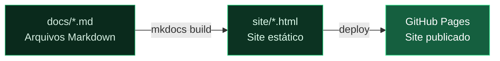

# Módulo 3 — Markdown e MkDocs

> **Para quem é este módulo:** quem vai escrever e publicar documentação — redatores técnicos, PMs e Engenheiros.
>
> **Por que este módulo vem agora:** com o ambiente já pronto, a atenção passa para a produção do conteúdo. Este módulo ensina a escrever em Markdown e a validar localmente como o material será exibido no site gerado pelo MkDocs.

!!! abstract "🎯 Objetivos de aprendizagem"
    Neste módulo você vai aprender:

    - O que é Markdown e por que usá-lo em vez de Word/Google Docs
    - Toda a sintaxe essencial (títulos, listas, tabelas, imagens, código)
    - Como o MkDocs transforma arquivos `.md` em um site navegável
    - Como configurar o `mkdocs.yml` e visualizar o site localmente

---

## 1. O que é Markdown?

Markdown é uma **linguagem de marcação leve**: você escreve texto simples com símbolos especiais para indicar formatação. O texto resultante pode ser renderizado como HTML, PDF ou sites.

### Por que Markdown para documentação técnica?

| Característica | Markdown | Word / Google Docs |
|---|---|---|
| Formato | Texto puro (`.md`) | Binário proprietário |
| Controle de versão com Git | Diff linha a linha, claro | Diffs ilegíveis |
| Renderização web | Nativa (GitHub, MkDocs) | Precisa converter |
| Foco no conteúdo | Sem botões de formatação | Tentação de estilizar |
| Portabilidade | Qualquer editor de texto | Depende do software |

---

## 2. Sintaxe Markdown Essencial

### Títulos

```markdown
# Título nível 1  (H1 — usado uma vez por página)
## Título nível 2  (H2 — seções principais)
### Título nível 3  (H3 — subseções)
#### Título nível 4  (H4 — detalhes)
```

---

### Parágrafos e quebras de linha

Deixe uma linha em branco entre parágrafos. Uma única quebra de linha dentro do mesmo bloco é ignorada.

```markdown
Primeiro parágrafo.

Segundo parágrafo.
```

---

### Ênfase

```markdown
**negrito**        → **negrito**
*itálico*          → *itálico*
~~tachado~~        → ~~tachado~~
`código inline`    → `código inline`
```

---

### Listas

**Lista não-ordenada:**
```markdown
- Item A
- Item B
  - Sub-item B1
  - Sub-item B2
- Item C
```

**Lista ordenada:**
```markdown
1. Primeiro passo
2. Segundo passo
3. Terceiro passo
```

**Lista de tarefas (checklist):**
```markdown
- [x] Revisado
- [ ] Aguardando aprovação
- [ ] Publicado
```

---

### Links

```markdown
[Texto do link](https://exemplo.com)
[Link para outra página](../collab/introducao.md)
```

---

### Imagens

A sintaxe básica para inserir uma imagem é:

```markdown

```

O **texto alternativo** é exibido quando a imagem não carrega e é lido por leitores de tela — sempre preencha com uma descrição útil.

#### Convenção de pastas para imagens

Adote a seguinte convenção: **cada pasta de documentação tem uma subpasta `img/`** com as imagens usadas pelos arquivos `.md` daquela mesma pasta.

```
docs/
├── 01-introducao.md
├── 02-configuracao.md
├── img/
│   ├── tela-login.png
│   ├── diagrama-fluxo.png
│   └── configuracao-avancada.png
├── collab/
│   ├── index.md
│   ├── cde.md
│   └── img/
│       ├── painel-cde.png
│       └── estrutura-pastas.png
```

Com essa estrutura, o caminho de referência é sempre **relativo ao arquivo `.md`**:

```markdown
<!-- Em docs/02-configuracao.md -->


<!-- Em docs/collab/cde.md -->

```

#### Por que caminhos relativos?

- Funcionam tanto no `mkdocs serve` local quanto no site publicado
- Não quebram ao mover o bloco de documentação para outro repositório
- O GitHub também renderiza as imagens ao navegar pelo arquivo `.md` no browser

#### Boas práticas

| Prática | Exemplo |
|---|---|
| Use nomes descritivos (sem espaços) | `diagrama-fluxo-aprovacao.png` |
| Prefira PNG para capturas de tela | Lossless, texto legível |
| Prefira SVG para diagramas | Escalável e leve |
| Mantenha imagens < 200 KB quando possível | Carregamento rápido |

---

### Tabelas

```markdown
| Coluna A | Coluna B | Coluna C |
|----------|----------|----------|
| Valor 1  | Valor 2  | Valor 3  |
| Valor 4  | Valor 5  | Valor 6  |
```

Resultado:

| Coluna A | Coluna B | Coluna C |
|----------|----------|----------|
| Valor 1  | Valor 2  | Valor 3  |
| Valor 4  | Valor 5  | Valor 6  |

---

### Blocos de código

````markdown
```python
def hello():
    print("olá, mundo")
```
````

Especifique a linguagem logo após as três crases para habilitar syntax highlighting.

---

### Citações (blockquote)

```markdown
> Esta é uma nota importante ou citação.
> Pode ter múltiplas linhas.
```

---

### Admonitions (extensão `admonition`)

A extensão `admonition` do Python-Markdown (habilitada no `mkdocs.yml`) adiciona caixas de destaque coloridas ao texto. Elas são amplamente usadas neste curso e nos repositórios de documentação da AltoQi.

#### Sintaxe básica

```markdown
!!! note "Nota"
    Informação complementar que não interrompe o fluxo.
    O conteúdo deve ter 4 espaços de indentação.

!!! warning "Atenção"
    Algo que o usuário precisa observar com cuidado.

!!! tip "Dica"
    Atalho ou boa prática recomendada.

!!! danger "Perigo"
    Ação que pode causar perda de dados ou danos irreversíveis.

!!! important "Importante"
    Requisito ou pré-condição essencial.
```

O título entre aspas é **opcional** — se omitido, o tipo é usado como título automaticamente:

```markdown
!!! tip
    Esta dica não tem título personalizado — exibe "Tip" como padrão.
```

#### Veja como ficam renderizados

!!! note "Nota"
    Informação complementar que não interrompe o fluxo.

!!! tip "Dica"
    Atalho ou boa prática recomendada.

!!! warning "Atenção"
    Algo que o usuário precisa observar com cuidado.

!!! danger "Perigo"
    Ação que pode causar perda de dados ou danos irreversíveis.

!!! important "Importante"
    Requisito ou pré-condição essencial.

#### Todos os tipos disponíveis no tema ReadTheDocs

| Tipo | Cor | Uso recomendado |
|---|---|---|
| `note` | Azul | Observação ou informação complementar |
| `tip` / `hint` | Verde | Dica, atalho, boa prática |
| `important` | Roxo | Requisito obrigatório ou pré-condição |
| `warning` / `caution` | Laranja | Situação que pode causar erros |
| `danger` / `error` | Vermelho | Ação destrutiva ou irreversível |
| `abstract` / `summary` | Ciano | Resumo de objetivos de aprendizagem |
| `success` / `check` | Verde claro | Confirmação de conclusão ou checklist |
| `info` | Azul claro | Referência ou contexto extra |

#### Conteúdo dentro de admonitions

Você pode colocar listas, código e até múltiplos parágrafos — basta manter a indentação de 4 espaços:

```markdown
!!! warning "Antes de continuar"
    Verifique os seguintes itens:

    - O Python 3.10 ou superior está instalado
    - O `requirements.txt` foi instalado com `pip install -r requirements.txt`
    - Você está dentro da pasta correta do repositório

    Se qualquer item estiver pendente, resolva antes de prosseguir.
```

!!! warning "Antes de continuar"
    Verifique os seguintes itens:

    - O Python 3.10 ou superior está instalado
    - O `requirements.txt` foi instalado com `pip install -r requirements.txt`
    - Você está dentro da pasta correta do repositório

    Se qualquer item estiver pendente, resolva antes de prosseguir.

#### Admonition colapsável (`???`)

Use `???` em vez de `!!!` para criar uma caixa que começa **fechada** — útil para conteúdo opcional, glossários ou detalhes avançados:

```markdown
??? note "Detalhes técnicos (opcional)"
    Esta seção explica o funcionamento interno do MkDocs para quem quiser aprofundar.
    Não é necessária para o uso no dia a dia.
```

??? note "Detalhes técnicos (opcional)"
    Esta seção explica o funcionamento interno do MkDocs para quem quiser aprofundar.
    Não é necessária para o uso no dia a dia.

Use `???+` para começar **aberta** e permitir que o leitor feche:

```markdown
???+ tip "Atalhos do VS Code"
    - `Ctrl+Shift+V` — preview de Markdown
    - `Ctrl+K V` — preview ao lado
```

???+ tip "Atalhos do VS Code"
    - `Ctrl+Shift+V` — preview de Markdown
    - `Ctrl+K V` — preview ao lado

#### Erros comuns de indentação

!!! danger "Indentação incorreta quebra a admonition"
    O conteúdo **deve** ter exatamente 4 espaços. Usar tab ou 2 espaços faz o texto sair da caixa e ser renderizado como parágrafo comum.

```markdown
# ✅ Correto — 4 espaços
!!! tip "Dica"
    Este texto está dentro da caixa.

# ❌ Errado — 2 espaços
!!! tip "Dica"
  Este texto ficará fora da caixa.

# ❌ Errado — sem indentação
!!! tip "Dica"
Este texto ficará fora da caixa.
```

---

### Frontmatter YAML

Toda página de documentação no projeto Visus começa com um bloco de metadados:

```yaml
---
title: Introdução ao Módulo Collab
type: visao-geral
created: 2025-01-10
updated: 2025-06-05
sources: [link-da-fonte-1, pdf-fonte-2]
tags: [collab, CDE, modelos-bim]
---
```

Este bloco é invisível para o leitor final, mas é usado pelo MkDocs para gerar títulos, metadados de SEO e navegação.

!!! tip "Não precisa decorar"
    O comando `/nova-pagina` (ver [Módulo 6](./06-claude-code-customizacao.md)) preenche o frontmatter automaticamente. Basta saber que ele existe e para que serve.

---

## 3. O que é MkDocs?

**MkDocs** é um gerador de site estático voltado para documentação. Ele pega os arquivos `.md` do diretório `docs/` e os transforma em um site HTML navegável.

### Como funciona?



A configuração central fica em `mkdocs.yml` na raiz do repositório.

### Estrutura de pastas no repositório

Um repositório com MkDocs tem sempre **uma única pasta de documentação publicada** — por padrão chamada `docs/`, mas pode ter qualquer outro nome. O nome escolhido é declarado no `mkdocs.yml` via `docs_dir`:

```yaml
docs_dir: docs   # qualquer outro nome também funciona
```

Além dessa pasta, o repositório pode conter **qualquer número de pastas auxiliares** — rascunhos, materiais de apoio, scripts, prompts, etc. — que ficam versionadas no Git mas **não são publicadas** pelo MkDocs.

```
repositorio/
├── mkdocs.yml
├── docs/              ← única pasta publicada pelo MkDocs
│   ├── index.md
│   └── modulo-1.md
├── rascunhos/         ← pasta auxiliar (versionada, mas não publicada)
├── prompts/           ← pasta auxiliar (versionada, mas não publicada)
└── site/              ← gerada pelo mkdocs build (não versionada — está no .gitignore)
```

!!! important "A pasta `site/` não é uma pasta auxiliar"
    A pasta `site/` é gerada automaticamente pelo `mkdocs build` e está no `.gitignore`. Ela **não** deve ser commitada nem confundida com pastas auxiliares — é apenas o artefato de saída do build.

---

## 4. O arquivo `mkdocs.yml`

Este arquivo controla tudo: nome do site, tema, plugins, extensões, estrutura de navegação.

```yaml
site_name: AltoQi Visus — Documentação
docs_dir: docs          # onde estão os arquivos .md
site_dir: site          # onde o HTML gerado será salvo

theme:
  name: readthedocs      # tema usado pelo projeto Visus
  language: pt-BR

plugins:
  - search               # busca em texto completo
  - awesome-pages        # controla a navegação via arquivos .pages

markdown_extensions:
  - admonition           # caixas !!! note, !!! warning etc.
  - tables               # tabelas GFM
  - toc:
      permalink: true    # âncora # em cada título
```

---

## 5. Tema ReadTheDocs

O projeto Visus usa o tema **ReadTheDocs** — limpo, com navegação lateral hierárquica e ótima legibilidade para documentação técnica.

Características do tema:

| Recurso | Descrição |
|---|---|
| Navegação lateral | Índice hierárquico fixo à esquerda |
| Busca integrada | Campo de busca no topo da barra lateral |
| Admonitions | Caixas `!!! note`, `!!! warning` etc. |
| Responsivo | Funciona em desktop e mobile |
| Fontes customizáveis | Configuradas no `mkdocs.yml` via `extra_css` |

---

## 6. Plugin `awesome-pages`

Este plugin permite controlar a **ordem e os rótulos** da navegação por meio de arquivos `.pages` dentro de cada pasta. Sem ele, o MkDocs usa ordem alfabética e o nome do arquivo como rótulo.

### Controlar ordem e definir título no `.pages`

No `.pages` você pode listar os arquivos na ordem desejada e atribuir um rótulo personalizado para cada entrada na barra de navegação:

```yaml
# docs/collab/.pages
nav:
  - index.md                              # usa o título definido no próprio arquivo
  - "Ambiente Comum de Dados": cde.md     # rótulo explícito na navegação
  - "Modelos BIM": modelos-bim.md
  - gestao-documental.md
```

O rótulo definido aqui afeta **apenas o item de menu** — não altera o título `<h1>` exibido dentro da página.

---

### Definir o título via frontmatter do `.md`

A alternativa (e a mais recomendada para o projeto Visus) é definir o título diretamente no frontmatter de cada página:

```yaml
---
title: Ambiente Comum de Dados
type: visao-geral
created: 2025-03-01
updated: 2026-06-05
---
```

Com isso, o MkDocs usa o valor de `title` como rótulo na navegação **e** como título da página — sem precisar duplicar a informação no `.pages`.

---

### Quando usar cada abordagem

| Situação | Onde definir o título |
|---|---|
| Título do menu igual ao título da página | Frontmatter `title:` no `.md` |
| Menu com rótulo diferente do `<h1>` da página | `.pages` com `"Rótulo": arquivo.md` |
| Controlar apenas a ordem, sem mudar títulos | `.pages` listando só os nomes dos arquivos |

---

## 7. Pré-requisitos e instalação

- Python 3.10 ou superior instalado
- Terminal (PowerShell no Windows)

```bash
pip install -r requirements.txt
```

O `requirements.txt` do projeto Visus contém:

```
mkdocs>=1.6
mkdocs-awesome-pages-plugin>=2.9
```

---

## 8. Gerar o site estático (`mkdocs build`)

```bash
mkdocs build
```

Isso lê todos os arquivos `.md` em `docs/` e gera a pasta `site/` com HTML, CSS e JS prontos para hospedar em qualquer servidor web.

```
docs/*.md  ──►  mkdocs build  ──►  site/*.html
```

> **Importante:** a pasta `site/` está no `.gitignore` — ela nunca deve ser commitada. O build é sempre gerado a partir dos fontes `.md`.

---

## 9. Visualizar localmente (`mkdocs serve`)

```bash
mkdocs serve
```

Inicia um servidor local em `http://localhost:8000`. O site **atualiza automaticamente** ao salvar qualquer arquivo `.md` — útil para revisar formatação, links e navegação antes de commitar.

Ou use o script do projeto:

```powershell
.\serve.ps1
```

> `mkdocs serve` é apenas para visualização local — não publica nada. Use `mkdocs build` para gerar o site final.

---

## 10. Referência Rápida de Markdown

| Sintaxe | Resultado |
|---|---|
| `# Título` | Título H1 |
| `## Seção` | Título H2 |
| `**negrito**` | **negrito** |
| `*itálico*` | *itálico* |
| `` `código` `` | `código` |
| `[link](url)` | Hiperlink |
| `` | Imagem |
| `> citação` | Blockquote |
| `- item` | Lista |
| `1. item` | Lista numerada |
| `\| col \|` | Tabela |
| `---` | Linha horizontal |

---

!!! success "✅ Resumo do módulo"
    Markdown é texto simples com marcações leves, mais portável que Word ou Google Docs. Você aprendeu a sintaxe essencial (títulos, listas, tabelas, imagens e código) e como o **MkDocs** transforma arquivos `.md` em um site navegável — configurando o `mkdocs.yml` e visualizando tudo localmente com `mkdocs serve`.

---

> **Módulo anterior:** [02 — VS Code e Claude Code](./02-vscode-e-claude-code.md)  
> **Próximo módulo:** [04 — Branches e Pull Requests](./04-branches-e-pull-requests.md)
