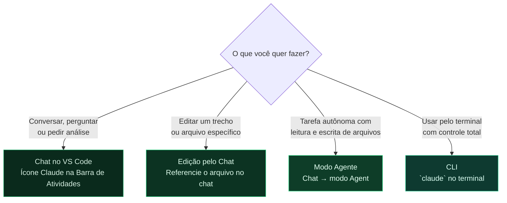

# Módulo 4 — Claude Code para Documentação

> **Para quem é este módulo:** toda a equipe que vai escrever documentação com apoio de IA.
>
> **Por que este módulo vem agora:** depois de aprender Git, Markdown e MkDocs, você já sabe ler, formatar e avaliar o conteúdo que será produzido. Agora entra o Claude Code como redator técnico assistente dentro do VS Code — acelerando a escrita e a revisão sobre uma base que você já entende.

!!! abstract "🎯 Objetivos de aprendizagem"
    Neste módulo você vai aprender:

    - O que é o Claude Code e o que ele pode fazer
    - Os modos de uso do Claude Code e quando usar cada um
    - Boas práticas para IA generativa em documentação

---

## 1. O que é o Claude Code?

!!! warning "Acesso necessário"
    O Claude Code requer acesso ao serviço Anthropic (via API key individual ou configurada pela organização). Consulte seu gestor para verificar se sua conta já tem acesso configurado.

O Claude Code é um **assistente de IA desenvolvido pela Anthropic**, disponível como extensão do VS Code e como ferramenta de linha de comando (CLI). Diferente de IAs de sugestão inline, o Claude Code opera como um **agente**: ele lê o contexto completo do repositório, edita arquivos diretamente e executa tarefas de múltiplos passos de forma autônoma.

O Claude Code pode:

- **Entender o repositório inteiro** antes de responder — lê estrutura, histórico e conteúdo
- **Gerar rascunhos** de páginas de documentação a partir de uma instrução
- **Editar arquivos diretamente**, com confirmação explícita do usuário antes de cada alteração
- **Revisar e melhorar** textos existentes para clareza, consistência e tom
- **Responder dúvidas** sobre Git, MkDocs, Markdown e o conteúdo do repositório
- **Executar tarefas autônomas de múltiplos passos** no modo agente

O Claude Code usa o contexto dos arquivos abertos e do repositório inteiro para gerar respostas relevantes ao seu projeto específico.

---

## 2. Modos de uso do Claude Code

Use o diagrama abaixo para decidir qual modo usar:



### 2.1 Chat no VS Code

Clique no ícone **Claude** na Barra de Atividades para abrir o painel de chat ao lado do editor. Ideal para:

- Fazer perguntas sobre o conteúdo do repositório
- Pedir análises de estrutura
- Solicitar rascunhos de conteúdo sem editar arquivos imediatamente
- Tirar dúvidas sobre Markdown, MkDocs ou Git

**Exemplos de uso:**

```
Analise a página docs/collab/introducao.md e sugira melhorias de clareza
e estrutura para um público de engenheiros civis.
```

```
Quais páginas da documentação ainda não têm uma seção de "Pré-requisitos"?
```

```
Crie o rascunho de uma nova página para docs/bid/fornecedores.md com
frontmatter YAML seguindo o padrão do projeto.
```

---

### 2.2 Edição pelo Chat

No painel de chat, referencie um arquivo específico digitando `#` seguido do nome do arquivo e peça ao Claude Code para fazer alterações. O Claude Code vai propor as edições — você revisa o diff e aceita ou rejeita cada mudança antes que ela seja aplicada.

**Exemplo:**

```
#introducao.md Reescreva o primeiro parágrafo para um tom mais direto e técnico.
```

O Claude Code gera a edição, apresenta o diff para aprovação e só aplica após sua confirmação. Nada é alterado sem que você confirme.

---

### 2.3 Modo Agente (aba CLAUDE CODE)

O **Modo Agente** é a forma mais poderosa do Claude Code: ele executa tarefas de múltiplos passos de forma autônoma, lendo e escrevendo arquivos, rodando comandos no terminal e tomando decisões com base no contexto do repositório.

Para ativar: clique na aba **CLAUDE CODE** (não na aba **CHAT**) no topo do painel. A aba CLAUDE CODE é o modo agente — ela tem acesso total ao repositório e pode planejar e executar sequências de ações sem intervenção manual a cada passo.

#### Controles principais da aba CLAUDE CODE

Na barra inferior do painel, alguns controles aparecem com frequência:

- **`+`**: adiciona contexto extra à conversa — arquivos, seleção atual do editor, imagens ou outros anexos úteis.
- **`/`**: abre um menu de ações rápidas organizado em seis seções:
    - **Context** — anexar um arquivo (`Attach file...`), mencionar um arquivo do projeto (`Mention file from this project...`), limpar a conversa (`Clear conversation`) ou desfazer até um ponto anterior (`Rewind`).
    - **Model** — trocar o modelo em uso (`Switch model...`, exibe o atual, ex.: Sonnet 4.6), ativar o modo de raciocínio estendido (`Thinking`) e configurar troca automática de modelo quando uma mensagem for sinalizada. Ao clicar em `Switch model`, as opções disponíveis são:

        | Modelo | Versão | Indicado para |
        |---|---|---|
        | **Default (recommended)** | Opus 4.8 · 1M contexto | Alias para o Opus; escolha automática da Anthropic para uso geral |
        | **Opus** | Opus 4.8 · 1M contexto | Raciocínio profundo, análises longas e tarefas complexas |
        | **Sonnet** | Sonnet 4.6 | Equilíbrio entre capacidade e velocidade; suficiente para a maioria das tarefas |
        | **Haiku** | Haiku 4.5 | O mais rápido; ideal para perguntas curtas e diretas |
        | **Fable** | Claude Fable 5 | Modelo novo em acesso restrito — pode aparecer como desabilitado |

        O modelo atualmente ativo é indicado com um ✓. Deixar no **Default** já usa o Opus, o modelo mais capaz. Para documentação rotineira, **Sonnet** é suficiente e consome menos créditos.
    - **Customize** — gerenciar plugins (`Manage plugins`) e abrir o Claude Code no terminal integrado (`Open Claude in Terminal`).
    - **Slash Commands** — lista os slash commands disponíveis no projeto (ex.: `/remote-control`).
    - **Settings** — trocar de conta (`Switch account`) e abrir as configurações gerais (`General config...`).
    - **Support** — acessar a documentação de ajuda (`View help docs`) e reportar um problema (`Report a problem`). A versão instalada da extensão também é exibida aqui (ex.: v2.1.183).
- **Indicador de seleção** (ex.: `105 lines selected`): mostra o trecho de código ou texto atualmente selecionado no editor que será enviado como contexto.
- **`Ask before edits`**: controla como o agente pede confirmação antes de editar arquivos, rodar comandos ou executar ações potencialmente sensíveis.

!!! warning "Cuidado ao relaxar aprovações"
    Se você alterar o modo de **Ask before edits**, o agente pode executar edições e comandos com menos confirmações intermediárias. Isso acelera o fluxo, mas aumenta o risco de mudanças indesejadas. Para a maior parte do trabalho em documentação, mantenha o modo padrão.

**Exemplo de tarefa para o Agente:**

```
Leia todos os arquivos em docs/cost_management/ e crie um índice
em docs/cost_management/index.md listando todas as páginas com
seus títulos e uma linha de resumo de cada uma.
```

O agente vai ler cada arquivo, extrair o título e resumo, e criar o `index.md` automaticamente.

---

### 2.4 CLI (`claude` no terminal)

Abra o terminal integrado do VS Code e execute `claude` para iniciar uma sessão completa pela linha de comando. Ideal para:

- Operações complexas com controle passo a passo
- Uso com flags específicas (`--model`, `--allowedTools`, etc.)
- Integração com scripts de automação

```bash
claude
```

Na CLI, o Claude Code opera em modo agente por padrão, com acesso completo ao repositório e confirmação explícita antes de cada alteração.

---

## 3. Boas práticas ao usar Claude Code para documentação

### Dê contexto suficiente

O Claude Code responde muito melhor quando você fornece contexto claro:

❌ Ruim:
```
Escreva sobre o módulo.
```

✅ Bom:
```
Escreva uma página de documentação para o módulo de Planejamento 4D do
AltoQi Visus. O público é de engenheiros civis que usam BIM. Siga o
frontmatter YAML do projeto (title, type, created, updated, sources, tags).
```

---

### Não publique sem revisar

O Claude Code pode gerar informações incorretas (chamado de "alucinação"). **Toda saída gerada por IA deve ser revisada** antes de entrar em um commit.

Regra de ouro do projeto Visus:
> **Nunca invente conteúdo — toda informação deve ter origem em uma fonte fornecida pelo usuário.**

---

### Use o Claude Code para consistência

Peça ao Claude Code para:
- Verificar se a terminologia está consistente com outras páginas do repositório
- Garantir que o tom e estilo seguem o padrão estabelecido
- Identificar links internos quebrados ou páginas referenciadas que não existem

---

!!! success "✅ Resumo do módulo"
    O Claude Code é um assistente de IA que opera como **agente** dentro do VS Code e da CLI: lê o repositório inteiro, gera rascunhos, edita com confirmação e responde dúvidas. Você conheceu os **modos de uso** — Chat, Edição pelo Chat, Modo Agente e CLI — e quando usar cada um, além das boas práticas para gerar documentação confiável com IA.

---

> **Módulo anterior:** [03 — Markdown e MkDocs](./03-markdown-e-mkdocs.md)  
> **Próximo módulo:** [05 — Branches e Pull Requests](./05-branches-e-pull-requests.md)
