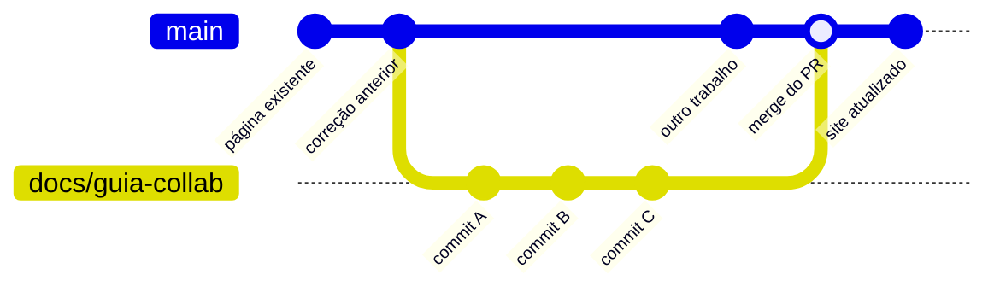

# Módulo 5 — Branches e Pull Requests

> **Pré-requisito:** leia o [Módulo 1 — Git para Documentação](./01-git-para-documentacao.md) antes de continuar. Este documento aprofunda o **Fluxo Completo** — branches isolados e revisão via Pull Request.

!!! abstract "🎯 Objetivos de aprendizagem"
    Neste módulo você vai aprender:

    - O que é um branch e por que ele existe
    - Como criar, navegar e trabalhar em branches
    - O que é um Pull Request e como fazer revisão
    - Como resolver conflitos de merge
    - O fluxo completo passo a passo

!!! tip "Não se preocupe se parecer complexo"
    90% do seu dia a dia é o fluxo simplificado (Módulo 1). Branches e PRs são para quando a equipe crescer ou o conteúdo precisar de revisão formal.

---

## Por que isso existe?

No fluxo simplificado, tudo que você commita e faz `push` vai direto para o `main` — e, consequentemente, para o site publicado. Isso funciona bem enquanto a equipe é pequena e os conteúdos são independentes.

À medida que a equipe cresce ou o conteúdo se torna mais crítico, surgem situações que o fluxo simplificado não cobre:

- Dois redatores editam arquivos próximos ao mesmo tempo e sobrescrevem o trabalho um do outro
- Um rascunho incompleto vai parar no site antes de estar pronto
- Não há como pedir revisão de conteúdo antes de publicar
- É difícil trabalhar num conjunto grande de mudanças sem atrapalhar quem está editando outras seções

A solução são dois conceitos: **branch** e **Pull Request**.

---

## 1. O que é um Branch?

Um branch é uma **linha do tempo paralela** do repositório. Enquanto o `main` continua estável e publicado, você trabalha numa cópia isolada — sem afetar ninguém.



Só quando você decidir (e alguém aprovar) é que esse trabalho é incorporado ao `main`.

### Criar um branch

```bash
git checkout -b docs/nome-da-tarefa
```

Esse comando cria o branch a partir do estado atual do `main` e já muda para ele.

**No VS Code:** clique em {: .vscode-icon} **nome do branch** na barra de status inferior → **Create new branch...** → digite o nome.

**Convenção de nomes:**

| Prefixo | Quando usar | Exemplo |
|---|---|---|
| `docs/` | Criação ou expansão de conteúdo | `docs/tutorial-planning` |
| `fix/` | Correção pontual de erro | `fix/link-quebrado-collab` |
| `refactor/` | Reorganização de estrutura | `refactor/renomear-secoes-bid` |

---

### Navegar entre branches

```bash
git checkout main              # voltar para o main
git checkout docs/guia-collab  # ir para um branch existente
```

**No VS Code:** clique em {: .vscode-icon} **nome do branch** na barra de status inferior → selecione o branch desejado na lista.

---

### Ver todos os branches

```bash
git branch -a    # local e remoto
```

---

## 2. Trabalhando no Branch

O fluxo dentro do branch é idêntico ao fluxo simplificado — você edita, faz `add`, `commit` e `push`. A diferença é que o `push` envia para o seu branch, não para o `main`:

```bash
git add .
git commit -m "docs: adiciona introdução ao módulo Collab"
git push origin docs/guia-collab
```

**No VS Code:** Painel {: .vscode-icon} Source Control → clique em {: .vscode-icon} para fazer stage → escreva a mensagem → {: .vscode-icon} **Commit** → {: .vscode-icon} **Sync Changes** (ou {: .vscode-icon} → **Push**).

Você pode fazer quantos commits quiser no branch. Enquanto não abrir o PR e ele não for mesclado, o `main` não é afetado.

---

## 3. O que é um Pull Request (PR)?

Um Pull Request é uma **proposta formal de mesclar um branch no `main`**. Ele é aberto no GitHub (não no terminal) e permite:

- **Revisão de conteúdo:** um colega lê o que você escreveu antes de publicar
- **Comentários linha a linha:** é possível comentar em trechos específicos
- **Histórico permanente:** toda a discussão fica registrada no repositório
- **Aprovação explícita:** o merge só acontece quando alguém aprova

### Abrir um PR

1. Após fazer `push` do branch, acesse o repositório no GitHub
2. Uma faixa amarela aparece: "Compare & pull request" — clique nela
3. Escreva um título descritivo e uma descrição do que foi adicionado/alterado
4. Atribua um revisor (campo "Reviewers")
5. Clique em **Create Pull Request**

### Revisar um PR

1. Acesse a aba **Pull requests** no repositório
2. Abra o PR designado para você
3. Vá em **Files changed** para ver exatamente o que mudou
4. Clique em qualquer linha para adicionar um comentário
5. Quando estiver satisfeito, clique em **Review changes → Approve**

### Mesclar (merge) o PR

Após aprovação, o próprio autor (ou o revisor) clica em **Merge pull request**. O conteúdo entra no `main` e o branch pode ser deletado.

---

## 4. Conflitos de Merge no Fluxo Completo

Quando dois branches alteram o mesmo trecho de um arquivo, o Git não consegue decidir sozinho qual versão manter. Isso é um **conflito de merge**.

O Git marca as diferenças no arquivo:

```
<<<<<<< HEAD
Texto que está no seu branch
=======
Texto que está no main
>>>>>>> main
```

### Resolver no VS Code

O VS Code detecta o conflito e exibe botões acima do trecho no Painel {: .vscode-icon} Source Control:

- **Accept Current Change** — mantém o que está no seu branch
- **Accept Incoming Change** — mantém o que veio do main
- **Accept Both Changes** — mantém os dois trechos
- **Compare Changes** — mostra o diff lado a lado

Após resolver, salve o arquivo, clique em {: .vscode-icon} para fazer stage e depois em {: .vscode-icon} **Commit**.

---

## 5. Estrutura de Branches do Repositório

```
main
  └── Branch de produção. Nunca recebe push direto no fluxo completo.
      Todo conteúdo chega via Pull Request revisado.

docs/<nome>
  └── Trabalho em andamento. Aberto por um redator para uma tarefa específica.
      Exemplo: docs/tutorial-planning, docs/visao-geral-bid

fix/<nome>
  └── Correção pontual de erro de conteúdo.
      Exemplo: fix/link-quebrado-collab, fix/terminologia-incorreta
```

> Branches devem ser de vida curta. Crie, trabalhe, abra o PR, mescle e delete. Branches que ficam abertos por semanas tendem a acumular conflitos.

---

## 6. Fluxo Completo — Referência Rápida

```
git pull                                  # atualizar main
git checkout -b docs/nome-da-tarefa       # criar branch
# ... editar arquivos ...
git add .
git commit -m "docs: descreve o que foi feito"
git push origin docs/nome-da-tarefa       # enviar branch para o GitHub

→ Abrir Pull Request no GitHub
→ Revisor aprova
→ Merge no main → site atualizado automaticamente
→ Deletar o branch
```

---

## Exercícios práticos

??? example "Exercício 1 — Criar um branch e trabalhar isolado"
    **Objetivo:** praticar o fluxo de branch sem afetar o main.

    1. Certifique-se de estar no `main` e atualizado (`git pull`)
    2. Crie um branch com seu nome:
       ```bash
       git checkout -b docs/pagina-seu-nome
       ```
    3. Crie o arquivo `docs/seu-nome-branch.md` com um título H1 e um parágrafo
    4. Faça commit:
       ```bash
       git add docs/seu-nome-branch.md
       git commit -m "docs: adiciona página de exercício de branch"
       ```
    5. Envie o branch para o GitHub:
       ```bash
       git push origin docs/pagina-seu-nome
       ```
    6. Verifique no GitHub que o branch existe mas o `main` ainda não tem o arquivo

    ✅ **Resultado esperado:** o arquivo existe apenas no branch — o main está intacto.

??? example "Exercício 2 — Abrir e revisar um Pull Request"
    **Objetivo:** criar um PR e simular o fluxo de revisão.

    1. Acesse o repositório no GitHub
    2. Clique em **Compare & pull request** (o GitHub detecta o branch recém-enviado)
    3. Preencha:
       - **Título:** `docs: adiciona página de exercício – [seu nome]`
       - **Descrição:** escreva em 2-3 linhas o que foi alterado
    4. Solicite revisão de um colega (campo **Reviewers**)
    5. O colega deve abrir o PR, ir em **Files changed** e adicionar um comentário inline em uma linha do arquivo
    6. Responda ao comentário e faça a correção sugerida com um novo commit no mesmo branch
    7. Após aprovação, clique em **Merge pull request** → **Confirm merge**
    8. Delete o branch após o merge

    ✅ **Resultado esperado:** a página chega ao main via PR revisado, com histórico de comentários.

??? example "Exercício 3 — Resolver um conflito de merge entre branches"
    **Objetivo:** reproduzir um conflito real entre dois branches e resolvê-lo.

    1. No `main`, crie o arquivo `docs/conflito-branches.md` com o texto: `"Versão original"`
    2. Crie dois branches a partir do main:
       ```bash
       git checkout -b docs/branch-a
       # edite docs/conflito-branches.md → "Versão do branch A"
       git add . ; git commit -m "docs: versão do branch A"

       git checkout main
       git checkout -b docs/branch-b
       # edite docs/conflito-branches.md → "Versão do branch B"
       git add . ; git commit -m "docs: versão do branch B"
       ```
    3. Faça merge do `branch-a` no `main` primeiro
    4. Tente fazer merge do `branch-b` — o Git vai reportar conflito
    5. Abra o VS Code, localize o arquivo conflitante no painel Source Control e resolva usando **Accept Both Changes**
    6. Ajuste o texto final manualmente, faça stage e commit

    ✅ **Resultado esperado:** o conflito é resolvido e o arquivo final contém o conteúdo correto.

!!! success "✅ Resumo do módulo"
    **Branches** isolam um trabalho em andamento sem afetar o `main`, e o **Pull Request** permite revisar o conteúdo antes de publicar. Você viu como criar e navegar em branches, abrir e revisar um PR, resolver conflitos de merge e executar o fluxo completo passo a passo.

---

> **Módulo anterior:** [01 — Git para Documentação](./01-git-para-documentacao.md)  
> **Índice:** [Início](./index.md)
