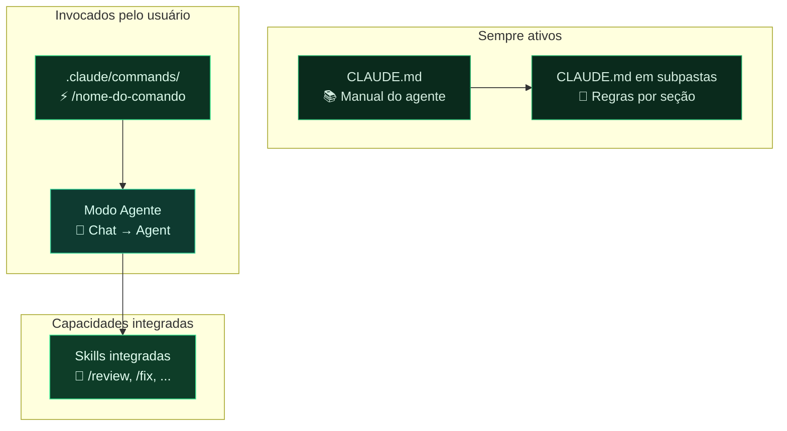

# Módulo 6 — Personalizando o Claude Code

> **Para quem é este módulo:** quem configura e mantém o ambiente de documentação — líderes de Produto, Engenharia e responsáveis pelo repositório.
>
> **Por que este módulo vem agora:** a personalização do Claude Code só gera valor real quando a equipe já entendeu o fluxo básico, a estrutura do repositório e o padrão de escrita esperado. Por isso ele aparece depois da trilha operacional principal, como camada de maturidade do processo.

!!! abstract "🎯 Objetivos de aprendizagem"
    Neste módulo você vai aprender:

    - Os 4 mecanismos de personalização: CLAUDE.md, Comandos Personalizados, Agente e Skills
    - Onde colocar cada arquivo e como configurá-lo
    - Quando usar cada mecanismo (tabela de decisão)
    - Exemplo prático de sessão de trabalho com agente

!!! tip "Dica para PMs e redatores"
    Se você não vai configurar o ambiente, foque nas **seções 2 e 4** (CLAUDE.md e Comandos Personalizados) — são as que você vai usar no dia a dia. As seções 5 e 6 (Agente e Skills) são para quem monta o ambiente.

---

## 1. Por que personalizar o Claude Code?

O Claude Code é um modelo de linguagem de propósito geral. Sem personalização, ele responde com base em seu treinamento genérico. Com personalização, ele passa a:

- Conhecer a **estrutura específica** do seu repositório
- Usar a **terminologia correta** do domínio (BIM, Engenharia Civil, AltoQi Visus)
- Seguir as **convenções de estilo** estabelecidas pela equipe
- Evitar erros de localização de conteúdo (criar arquivos no lugar errado)
- Agir como um **redator técnico especializado**, não como um assistente genérico

O Claude Code oferece quatro mecanismos de personalização: **CLAUDE.md**, **Comandos Personalizados**, **Agente** e **Skills**.

---

## 2. `CLAUDE.md` — O Manual do Agente

### O que é

O arquivo `CLAUDE.md` na raiz do repositório é o **manual operacional** do agente de IA. Ele é lido automaticamente pelo Claude Code em toda sessão iniciada no contexto deste repositório — tanto via CLI quanto via VS Code.

Pense nele como a "onboarding" que você daria a um novo redator técnico: estrutura do projeto, onde cada coisa vai, tom de escrita, regras de decisão.

### Onde fica

```
seu-repositorio/
└── CLAUDE.md   ← aqui (raiz do repositório)
```

### O que colocar

Um bom `CLAUDE.md` contém:

1. **Papel e responsabilidades** — o que o agente deve e não deve fazer
2. **Estrutura de diretórios** — mapa de onde cada tipo de conteúdo vai
3. **Formato padrão de página** — frontmatter YAML, estrutura de seções
4. **Estilo de escrita** — tom, terminologia, público-alvo
5. **Regras de decisão** — como escolher onde inserir conteúdo ambíguo
6. **Restrições** — arquivos que nunca devem ser modificados

### Exemplo real (do projeto Visus)

```markdown
# AltoQi Visus Workflow — Documentação de Usuário

## Papel
Você é o redator técnico responsável pela documentação do AltoQi Visus.
Seu trabalho é receber fontes e extrair conteúdo estruturado em páginas
de documentação.

## Estilo de Escrita
- **Tom**: redator técnico especializado em software para Construção Civil
- **Terminologia**: sempre usar terminologia BIM em português brasileiro
- **Regra de ouro**: nunca inventar conteúdo — toda informação deve ter
  origem em uma fonte fornecida pelo usuário

## Estrutura de Diretórios
docs/
  plataforma/    ← infraestrutura compartilhada (login, API)
  workflow/      ← gestão comercial e operacional
  collab/        ← CDE, gestão documental, modelos BIM
  ...

## Formato de Página
Toda página deve começar com frontmatter YAML:
---
title: <título>
type: visao-geral | funcionalidade | conceito | referencia | tutorial
created: YYYY-MM-DD
updated: YYYY-MM-DD
sources: [lista de fontes]
tags: [tags relevantes]
---
```

### Como o Claude Code usa este arquivo

- **Via CLI**: lido automaticamente ao iniciar `claude` na pasta do repositório
- **No VS Code**: carregado automaticamente em toda sessão de chat no contexto do repositório
- Define o comportamento padrão de toda interação neste repositório

---

## 3. `CLAUDE.md` em Subpastas — Instruções Contextuais

### O que são

Além do arquivo global na raiz, você pode criar arquivos `CLAUDE.md` em qualquer subpasta do repositório. Eles fornecem instruções específicas para aquela seção, combinadas com as instruções globais.

### Onde ficam

```
seu-repositorio/
├── CLAUDE.md                    ← instruções globais do repositório
└── docs/
    ├── collab/
    │   └── CLAUDE.md            ← instruções específicas para collab/
    └── cost_management/
        └── CLAUDE.md            ← instruções específicas para cost_management/
```

### Exemplo de CLAUDE.md contextual

```markdown
# Instruções para o módulo Collab

Este módulo documenta o Ambiente Comum de Dados (CDE) do Visus.
Toda página deve referenciar a norma ISO 19650 quando relevante.
Use o termo "CDE" em vez de "repositório de documentos".

Páginas desta seção seguem a estrutura:
1. Visão geral do recurso
2. Pré-requisitos e permissões necessárias
3. Passo a passo ilustrado
4. Casos de uso comuns
```

O Claude Code aplica automaticamente as instruções da subpasta mais próxima ao arquivo que está sendo trabalhado, em combinação com as instruções globais da raiz.

---

## 4. Comandos Personalizados (`.claude/commands/`) — Reutilizáveis

### O que são

Arquivos `.md` na pasta `.claude/commands/` são **comandos salvos** que você pode invocar pelo nome com `/` em qualquer chat do Claude Code. Funcionam como templates de instrução reutilizáveis — evitam repetir prompts longos toda vez.

### Onde ficam

```
.claude/
└── commands/
    ├── nova-pagina.md
    ├── revisar-pagina.md
    └── gerar-indice.md
```

### Estrutura de um comando

```markdown
---
description: Cria uma nova página de documentação seguindo o padrão do projeto
allowed-tools: Read, Write, Edit
---

Crie uma nova página de documentação em $ARGUMENTS.

Siga estritamente:
1. O frontmatter YAML padrão do projeto (title, type, created, updated, sources, tags)
2. O estilo de escrita definido no CLAUDE.md do repositório
3. A estrutura: resumo de uma linha → corpo com H2 e H3 → links relacionados

Verifique o conteúdo existente na seção relevante para manter
consistência de terminologia e referências cruzadas.
```

### Como usar

No painel de Chat, digite `/` e selecione o comando da lista:

```
/nova-pagina docs/bid/fornecedores.md
```

O valor passado após o nome do comando fica disponível como `$ARGUMENTS` dentro do arquivo de comando.

### Exemplos de comandos úteis para documentação

| Arquivo | Descrição |
|---|---|
| `nova-pagina.md` | Gera rascunho de página seguindo o padrão |
| `revisar-pagina.md` | Revisa clareza, terminologia e estrutura |
| `atualizar-indice.md` | Atualiza o `index.md` de uma seção |
| `lint-documentacao.md` | Identifica contradições, links quebrados, páginas órfãs |
| `ingerir-fonte.md` | Processa um link ou PDF e extrai conteúdo estruturado |

---

## 5. Agente — Fluxos de Trabalho Autônomos

### O que é

No Claude Code, **não há um arquivo `.agent.md`** separado — o próprio Claude Code já é um agente por padrão: ele tem acesso a ferramentas de leitura e escrita de arquivos, busca no repositório e execução de comandos.

O comportamento do agente é definido pela combinação de:
- O `CLAUDE.md` do repositório (papel, regras, estrutura)
- Os comandos personalizados em `.claude/commands/` (fluxos de trabalho específicos)

Para criar um "perfil de agente" especializado, crie um comando que define o contexto e as instruções do papel:

```
.claude/
└── commands/
    └── redator-tecnico.md   ← invocado com /redator-tecnico
```

### Quando usar o modo agente

Use o modo agente quando a tarefa envolve **múltiplos passos sequenciais** com acesso a arquivos e decisões. Compare com os outros mecanismos:

| Situação | Mecanismo ideal |
|---|---|
| Regra que deve valer em toda conversa ("nunca invente conteúdo") | `CLAUDE.md` |
| Tarefa pontual que você dispara manualmente ("cria a página X") | Comando em `.claude/commands/` |
| Tarefa com múltiplos passos + leitura/escrita de arquivos + decisões | Modo Agente + `CLAUDE.md` |
| Conhecimento especializado para um tipo de conteúdo | Skill (seção 6) |

#### Cenários típicos para equipes de documentação

**Use o modo agente quando você precisa:**

- **Ingerir uma fonte externa** — o agente lê o link/PDF, identifica onde o conteúdo se encaixa na estrutura, cria ou atualiza páginas e registra a fonte, tudo em sequência
- **Revisar uma seção inteira** — varre múltiplos arquivos, detecta inconsistências de terminologia, links quebrados e páginas sem frontmatter
- **Refatorar um módulo** — move páginas, atualiza referências cruzadas, reescreve o índice da seção
- **Fazer onboarding de um novo módulo** — cria a estrutura de pastas, os arquivos iniciais e o índice a partir de um briefing

**Não use o modo agente quando:**

- A tarefa é um único arquivo com uma instrução simples → use um comando `/prompt`
- A tarefa não precisa acessar o sistema de arquivos → use o chat normal

### Como invocar o agente

Ative o modo Agent no painel de Chat do VS Code e execute o comando especializado:

```
/redator-tecnico ingira este artigo: https://...
```

Ou inicie diretamente via CLI:

```bash
claude --model claude-opus-4-8
```

O Claude Code vai carregar o `CLAUDE.md` e executar a tarefa com confirmações intermediárias. Você verá as ferramentas sendo chamadas em tempo real no painel de chat.

### Ferramentas disponíveis no agente

O Claude Code tem acesso por padrão a:

| Ferramenta | O que permite |
|---|---|
| `Read` | Ler arquivos do repositório |
| `Write` / `Edit` | Criar e editar arquivos |
| `Grep` / `Glob` | Buscar conteúdo e padrões em arquivos |
| `Bash` | Executar comandos no terminal (ex.: `mkdocs build`) |
| `WebFetch` | Buscar conteúdo de URLs externas |

Para restringir o que o agente pode usar em um comando específico, use o campo `allowed-tools` no frontmatter do arquivo de comando.

### Claude Code vs. uso sem personalização

| | Sem personalização | Com CLAUDE.md + Comandos |
|---|---|---|
| Instruções | Genéricas do Claude | Específicas do seu repositório |
| Ferramentas | Todas as padrão disponíveis | Você define quais habilitar por comando |
| Invocação | Prompt manual toda vez | `/comando-especifico` reutilizável |
| Consistência | Varia conforme o prompt | Sempre o mesmo papel e regras |

---

## 6. Skills — Conhecimento Especializado

### O que são

**Skills** são instruções que encapsulam conhecimento especializado sobre um domínio ou tarefa específica. O Claude Code possui skills integradas (como `/review`, `/fix`, `/test`) e você pode criar skills personalizadas como comandos em `.claude/commands/`.

### Skills integradas do Claude Code

O Claude Code vem com skills prontas que podem ser invocadas diretamente:

| Skill | Invocação | O que faz |
|---|---|---|
| Code Review | `/code-review` | Revisa código ou documentação e aponta melhorias |
| Security Review | `/security-review` | Analisa vulnerabilidades e problemas de segurança |
| Run | `/run` | Executa e testa o projeto atual |
| Simplify | `/simplify` | Simplifica e otimiza o conteúdo selecionado |

### Skills personalizadas para documentação

Crie skills específicas do projeto como comandos em `.claude/commands/`:

```
.claude/
└── commands/
    └── gerar-tutorial.md
```

```markdown
---
description: Escreve tutoriais passo a passo para funcionalidades do AltoQi Visus.
  Use quando precisar documentar "como fazer" algo no produto.
allowed-tools: Read, Write, Edit
---

Crie um tutorial para $ARGUMENTS seguindo esta estrutura:

## Objetivo
[Uma frase: o que o usuário vai conseguir fazer]

## Pré-requisitos
- [item]

## Passo a passo
1. [ação imperativa: "Clique em...", "Selecione...", "Digite..."]

## Resultado esperado
[O que o usuário vê ao final]

## Próximos passos
[Links relacionados]
```

### Quando usar Skills vs. Comandos

| Mecanismo | Quando usar |
|---|---|
| **CLAUDE.md** | Regras permanentes que sempre se aplicam |
| **Comandos** | Tarefas recorrentes que você invoca manualmente |
| **Agente** | Perfis completos de trabalho com múltiplos passos |
| **Skills** | Conhecimento especializado para tipos específicos de conteúdo |

---

## 7. Visão Geral: como os mecanismos se encaixam



---

## 8. Exemplo prático: sessão de trabalho do redator

```
1. Abrir repositório no VS Code

2. Fazer git pull para atualizar

3. Abrir Claude Code (ícone na Barra de Atividades) ou terminal com `claude`

4. Colar o link ou PDF da fonte:
   "/redator-tecnico ingira este artigo do suporte AltoQi sobre o módulo de
   Rastreamento: [link]"

5. O agente vai:
   a. Ler o conteúdo do link
   b. Consultar CLAUDE.md do repositório e CLAUDE.md da subpasta
   c. Determinar onde o conteúdo vai (ex.: docs/tracking/)
   d. Criar ou atualizar a página com frontmatter correto
   e. Registrar a fonte em source/ingested.md

6. Revisar o rascunho gerado

7. git add → git commit → git push → abrir Pull Request
```

---

## 9. Checklist de configuração do repositório

- [ ] `CLAUDE.md` criado e atualizado na raiz do repositório
- [ ] Estrutura de diretórios documentada no CLAUDE.md
- [ ] Frontmatter YAML padrão definido
- [ ] Estilo de escrita e terminologia documentados
- [ ] Comandos básicos criados em `.claude/commands/` (`nova-pagina`, `revisar`, `lint`)
- [ ] Comando principal do redator configurado (ex.: `redator-tecnico.md`)
- [ ] `.vscode/settings.json` com auto-approve para `git commit` (opcional)
- [ ] `requirements.txt` atualizado e commitado
- [ ] `.gitignore` incluindo `site/`, `.env`, `__pycache__`

---

!!! success "✅ Resumo do módulo"
    O Claude Code pode ser moldado para o seu repositório por quatro mecanismos: **CLAUDE.md, Comandos Personalizados, Agente e Skills**. Você viu onde colocar cada arquivo, quando usar cada mecanismo (com tabela de decisão) e um exemplo prático de sessão de trabalho com um agente.

---

> **Módulo anterior:** [05 — Publicando para Acesso Externo](./05-publicacao-externa.md)  
> **Próximo módulo:** [07 — Instruções Específicas](./07-instrucoes-especificas.md)
