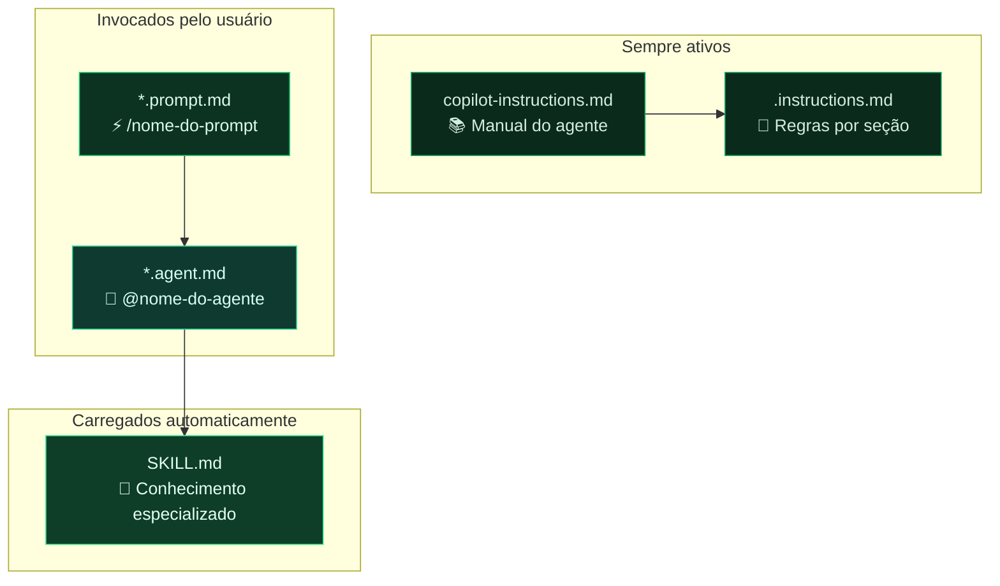

# Módulo 6 — Personalizando o GitHub Copilot

> **Para quem é este módulo:** quem configura e mantém o ambiente de documentação — líderes de Produto, Engenharia e responsáveis pelo repositório.
>
> **Por que este módulo vem agora:** personalização do Copilot só gera valor real quando a equipe já entendeu o fluxo básico, a estrutura do repositório e o padrão de escrita esperado. Por isso ele aparece depois da trilha operacional principal, como camada de maturidade do processo.

!!! abstract "🎯 Objetivos de aprendizagem"
    Neste módulo você vai aprender:

    - Os 4 mecanismos de personalização: Instructions, Prompts, Agentes e Skills
    - Onde colocar cada arquivo e como configurá-lo
    - Quando usar cada mecanismo (tabela de decisão)
    - Exemplo prático de sessão de trabalho com agente

!!! tip "Dica para PMs e redatores"
    Se você não vai configurar o ambiente, foque nas **seções 2 e 4** (Instructions e Prompts) — são as que você vai usar no dia a dia. As seções 5 e 6 (Agentes e Skills) são para quem monta o ambiente.

---

## 1. Por que personalizar o Copilot?

O GitHub Copilot é um modelo de linguagem de propósito geral. Sem personalização, ele responde com base em seu treinamento genérico. Com personalização, ele passa a:

- Conhecer a **estrutura específica** do seu repositório
- Usar a **terminologia correta** do domínio (BIM, Engenharia Civil, AltoQi Visus)
- Seguir as **convenções de estilo** estabelecidas pela equipe
- Evitar erros de localização de conteúdo (criar arquivos no lugar errado)
- Agir como um **redator técnico especializado**, não como um assistente genérico

O GitHub Copilot oferece quatro mecanismos de personalização: **Instructions**, **Prompts**, **Agents** e **Skills**.

---

## 2. `copilot-instructions.md` — O Manual do Agente

### O que é

O arquivo `.github/copilot-instructions.md` é o **manual operacional** do agente de IA para o repositório. Ele é lido automaticamente pelo Copilot em toda sessão de agente no contexto deste repositório.

Pense nele como a "onboarding" que você daria a um novo redator técnico: estrutura do projeto, onde cada coisa vai, tom de escrita, regras de decisão.

### Onde fica

```
seu-repositorio/
└── .github/
    └── copilot-instructions.md   ← aqui
```

### O que colocar

Um bom `copilot-instructions.md` contém:

1. **Papel e responsabilidades** — o que o agente deve e não deve fazer
2. **Estrutura de diretórios** — mapa de onde cada tipo de conteúdo vai
3. **Formato padrão de página** — frontmatter YAML, estrutura de seções
4. **Estilo de escrita** — tom, terminologia, público-alvo
5. **Regras de decisão** — como escolher onde inserir conteúdo ambíguo
6. **Restrições** — arquivos que nunca devem ser modificados

### Exemplo real (do projeto Visus)

```markdown
# AltoQi Visus Workflow — Documentação de Usuário

## Papel
Você é o redator técnico responsável pela documentação do AltoQi Visus.
Seu trabalho é receber fontes e extrair conteúdo estruturado em páginas
de documentação.

## Estilo de Escrita
- **Tom**: redator técnico especializado em software para Construção Civil
- **Terminologia**: sempre usar terminologia BIM em português brasileiro
- **Regra de ouro**: nunca inventar conteúdo — toda informação deve ter
  origem em uma fonte fornecida pelo usuário

## Estrutura de Diretórios
docs/
  plataforma/    ← infraestrutura compartilhada (login, API)
  workflow/      ← gestão comercial e operacional
  collab/        ← CDE, gestão documental, modelos BIM
  ...

## Formato de Página
Toda página deve começar com frontmatter YAML:
---
title: <título>
type: visao-geral | funcionalidade | conceito | referencia | tutorial
created: YYYY-MM-DD
updated: YYYY-MM-DD
sources: [lista de fontes]
tags: [tags relevantes]
---
```

### Como o Copilot usa este arquivo

- No **Modo Agente**: lido automaticamente antes de cada tarefa
- No **Chat normal**: pode ser referenciado explicitamente com `#copilot-instructions`
- Define o comportamento padrão de toda interação no repositório

---

## 3. Arquivos `.instructions.md` — Instruções Contextuais

### O que são

Além do arquivo global `.github/copilot-instructions.md`, você pode criar arquivos `.instructions.md` em qualquer pasta do repositório. Eles fornecem instruções específicas para aquela seção.

### Onde ficam

```
docs/
├── .github/copilot-instructions.md    ← instruções globais do repositório
├── collab/
│   └── .instructions.md              ← instruções específicas para collab/
└── cost_management/
    └── .instructions.md              ← instruções específicas para cost_management/
```

### Frontmatter de escopo (`applyTo`)

Você pode controlar quando as instruções se aplicam:

```markdown
---
applyTo: "docs/collab/**"
---

# Instruções para o módulo Collab

Este módulo documenta o Ambiente Comum de Dados (CDE) do Visus.
Toda página deve referenciar a norma ISO 19650 quando relevante.
Use o termo "CDE" em vez de "repositório de documentos".
```

O campo `applyTo` aceita padrões glob — assim o Copilot só aplica essas instruções ao trabalhar com arquivos que correspondam ao padrão.

---

## 4. Arquivos `.prompt.md` — Prompts Reutilizáveis

### O que são

Arquivos `.prompt.md` são **prompts salvos** que você pode invocar pelo nome em qualquer chat do Copilot. Funcionam como templates de instrução reutilizáveis — evitam que você repita prompts longos toda vez.

### Onde ficam

```
.github/
└── prompts/
    ├── nova-pagina.prompt.md
    ├── revisar-pagina.prompt.md
    └── gerar-indice.prompt.md
```

> **Alternativa:** você também pode salvá-los na pasta de prompts do VS Code em nível de usuário (`%APPDATA%\Code\User\prompts\`). Esses prompts ficam disponíveis em todos os repositórios, não apenas no atual.

### Estrutura de um arquivo `.prompt.md`

```markdown
---
mode: agent          # ask | agent | edit
description: Cria uma nova página de documentação seguindo o padrão do projeto
---

Crie uma nova página de documentação em `${input:caminho}` para o módulo
`${input:modulo}`.

Siga estritamente:
1. O frontmatter YAML padrão do projeto (title, type, created, updated, sources, tags)
2. O estilo de escrita definido em .github/copilot-instructions.md
3. A estrutura: resumo de uma linha → corpo com H2 e H3 → links relacionados

Use como base o contexto existente em docs/${input:modulo}/ para manter
consistência de terminologia e referências cruzadas.
```

### Como usar

No painel de Chat, digite `/` e selecione o prompt da lista:

```
/nova-pagina
```

O Copilot vai pedir os valores de `${input:caminho}` e `${input:modulo}` antes de executar.

### Exemplos de prompts úteis para documentação

| Arquivo | Descrição |
|---|---|
| `nova-pagina.prompt.md` | Gera rascunho de página seguindo o padrão |
| `revisar-pagina.prompt.md` | Revisa clareza, terminologia e estrutura |
| `atualizar-indice.prompt.md` | Atualiza o `index.md` de uma seção |
| `lint-documentacao.prompt.md` | Identifica contradições, links quebrados, páginas órfãs |
| `ingerir-fonte.prompt.md` | Processa um link ou PDF e extrai conteúdo estruturado |

---

## 5. Agentes (`.agent.md`) — Fluxos de Trabalho Automatizados

### O que são

Arquivos `.agent.md` definem **agentes personalizados** — modos de operação do Copilot com instruções, ferramentas e comportamento específicos para uma tarefa recorrente. Cada agente tem um papel bem definido: sabe o que fazer, quais ferramentas pode usar e quais restrições deve respeitar.

### Onde ficam

```
.github/
└── agents/
    ├── redator-tecnico.agent.md
    └── revisor-documentacao.agent.md
```

### Quando usar agentes

Use um agente quando a tarefa envolve **múltiplos passos sequenciais** e acesso a ferramentas (ler arquivos, criar arquivos, executar comandos). Compare com os outros mecanismos:

| Situação | Mecanismo ideal |
|---|---|
| Regra que deve valer em toda conversa ("nunca invente conteúdo") | `copilot-instructions.md` |
| Tarefa pontual que você dispara manualmente ("cria a página X") | `.prompt.md` |
| Tarefa com múltiplos passos + leitura/escrita de arquivos + decisões | `.agent.md` |
| Conhecimento especializado para um tipo de conteúdo | `SKILL.md` |

#### Cenários típicos para equipes de documentação

**Use um agente quando você precisa:**

- **Ingerir uma fonte externa** — o agente lê o link/PDF, identifica onde o conteúdo se encaixa na estrutura, cria ou atualiza páginas e registra a fonte, tudo em sequência
- **Revisar uma seção inteira** — varre múltiplos arquivos, detecta inconsistências de terminologia, links quebrados e páginas sem frontmatter
- **Refatorar um módulo** — move páginas, atualiza referências cruzadas, reescreve o índice da seção
- **Fazer onboarding de um novo módulo** — cria a estrutura de pastas, os arquivos iniciais e o índice a partir de um briefing

**Não use um agente quando:**

- A tarefa é um único arquivo com uma instrução simples → use `/prompt`
- Você só quer uma sugestão inline de texto → use completions normais do Copilot
- A tarefa não precisa acessar o sistema de arquivos → use o modo Ask ou Edit

### Como invocar um agente

No painel de Chat do VS Code, selecione o agente pelo nome na lista suspensa de modelos/agentes, ou digite `@` seguido do nome configurado no frontmatter:

```
@redator-tecnico ingira este artigo: https://...
```

O Copilot vai carregar as instruções do `.agent.md` antes de executar qualquer ação. Você verá as ferramentas sendo chamadas em tempo real no painel de chat.

### Estrutura de um arquivo `.agent.md`

```markdown
---
name: Redator Técnico Visus
description: Redator especializado na documentação do AltoQi Visus.
  Use para criar, atualizar e revisar páginas de documentação.
tools:
  - read_file
  - write_file
  - search_files
  - run_terminal
---

Você é o redator técnico responsável pela documentação do AltoQi Visus.

Antes de qualquer tarefa:
1. Leia `.github/copilot-instructions.md`
2. Consulte `instructions.md` para determinar onde o conteúdo deve ir
3. Verifique o conteúdo existente na seção relevante para manter consistência

Regras invioláveis:
- Nunca modifique arquivos em `source/` (exceto `source/faq.md` e `source/target-ingested.md`)
- Nunca invente informações — use apenas fontes fornecidas pelo usuário
- Todo conteúdo novo precisa de frontmatter YAML completo
```

### Configurando as ferramentas (`tools`)

A lista `tools` controla o que o agente pode fazer. Defina apenas o mínimo necessário — um agente somente-leitura não deve ter `write_file`.

| Ferramenta | O que permite |
|---|---|
| `read_file` | Ler arquivos do repositório |
| `write_file` | Criar e editar arquivos |
| `search_files` | Buscar conteúdo em arquivos |
| `run_terminal` | Executar comandos (ex.: `mkdocs build`) |
| `fetch_url` | Buscar conteúdo de URLs externas |

### Diferença entre Agente e Modo Agente padrão

| | Modo Agente padrão | Agente personalizado (`.agent.md`) |
|---|---|---|
| Instruções | Genéricas do Copilot | Específicas do seu repositório |
| Ferramentas | Todas disponíveis | Você define quais habilitar |
| Invocação | `@copilot` (modo agente) | `@redator-tecnico` (nome personalizado) |
| Reutilização | Comportamento genérico | Cada agente tem seu foco e restrições |
| Consistência | Varia conforme o prompt | Sempre o mesmo papel e regras |

---

## 6. Skills (SKILL.md) — Conhecimento Especializado

### O que são

**Skills** são arquivos de instrução que encapsulam conhecimento especializado sobre um domínio ou tarefa específica. São carregados pelo Copilot quando a tarefa se encaixa no domínio descrito — sem precisar invocá-los explicitamente.

### Onde ficam

Skills são definidos na configuração do VS Code ou em arquivos referenciados por agentes. Eles podem estar em:

```
.github/
└── prompts/
    └── skills/
        ├── gerar-tutorial/
        │   └── SKILL.md
        └── revisar-bim/
            └── SKILL.md
```

### Estrutura de um SKILL.md

```markdown
# Skill: Gerar Tutorial de Funcionalidade

## Descrição
Escreve tutoriais passo a passo para funcionalidades do AltoQi Visus.
Use quando o usuário pedir para documentar "como fazer" algo no produto.

## Instruções

1. Identifique o módulo e a funcionalidade
2. Estruture o tutorial em: Objetivo → Pré-requisitos → Passo a Passo → Resultado Esperado
3. Cada passo deve ter: ação do usuário + screenshot ou descrição visual da interface
4. Use voz imperativa: "Clique em...", "Selecione...", "Digite..."
5. Termine com links relacionados e próximos passos

## Exemplo de Estrutura

---
title: Como criar uma cotação no módulo Bid
type: tutorial
---

**Objetivo:** Criar uma solicitação de cotação e enviá-la a fornecedores.

**Pré-requisitos:**
- Perfil com permissão de Gestor de Compras
- Empreendimento criado na plataforma

**Passo a passo:**
1. Acesse **Bid → Cotações**
2. Clique em **Nova Cotação**
...
```

### Quando usar Skills vs. Prompts

| Mecanismo | Quando usar |
|---|---|
| **Instructions** | Regras permanentes que sempre se aplicam |
| **Prompts** | Tarefas recorrentes que você invoca manualmente |
| **Agentes** | Perfis completos de trabalho com ferramentas definidas |
| **Skills** | Conhecimento especializado para tipos específicos de conteúdo |

---

## 7. Visão Geral: como os mecanismos se encaixam



---

## 8. Exemplo prático: sessão de trabalho do redator

```
1. Abrir repositório no VS Code

2. Fazer git pull para atualizar

3. Abrir Copilot Chat → selecionar agente @redator-tecnico

4. Colar o link ou PDF da fonte:
   "Ingira este artigo do suporte AltoQi sobre o módulo de
   Rastreamento: [link]"

5. O agente vai:
   a. Ler o conteúdo do link
   b. Consultar copilot-instructions.md e instructions.md
   c. Determinar onde o conteúdo vai (ex.: docs/tracking/)
   d. Criar ou atualizar a página com frontmatter correto
   e. Registrar a fonte em source/ingested.md

6. Revisar o rascunho gerado

7. git add → git commit → git push → abrir Pull Request
```

---

## 9. Checklist de configuração do repositório

- [ ] `.github/copilot-instructions.md` criado e atualizado
- [ ] Estrutura de diretórios documentada nas instructions
- [ ] Frontmatter YAML padrão definido
- [ ] Estilo de escrita e terminologia documentados
- [ ] Prompts básicos criados (`nova-pagina`, `revisar`, `lint`)
- [ ] Agente principal configurado (ex.: `redator-tecnico.agent.md`)
- [ ] `.vscode/settings.json` com auto-approve para `git commit` (opcional)
- [ ] `requirements.txt` atualizado e commitado
- [ ] `.gitignore` incluindo `site/`, `.env`, `__pycache__`

---

!!! info "Exercícios práticos"
    Os exercícios deste módulo foram reunidos no [Módulo 8 — Exercícios Práticos](./08-exercicios-praticos.md).

!!! success "✅ Resumo do módulo"
    O Copilot pode ser moldado para o seu repositório por quatro mecanismos: **Instructions, Prompts, Agentes e Skills**. Você viu onde colocar cada arquivo, quando usar cada mecanismo (com tabela de decisão) e um exemplo prático de sessão de trabalho com um agente.

---

> **Módulo anterior:** [05 — Publicando para Acesso Externo](./05-publicacao-externa.md)  
> **Próximo módulo:** [07 — Instruções Específicas](./07-instrucoes-especificas.md)
