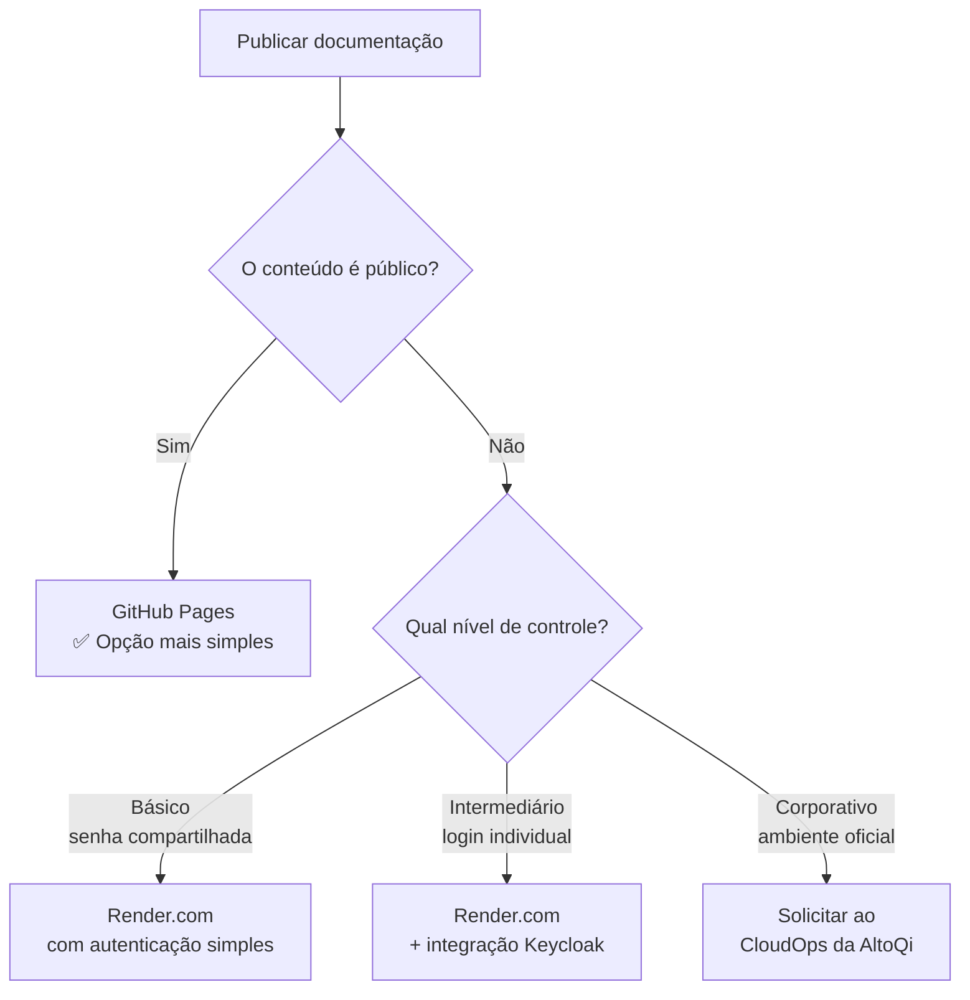
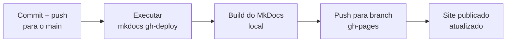

# Módulo 6 — Publicando para Acesso Externo

!!! abstract "🎯 Objetivos de aprendizagem"
    Neste módulo você vai aprender:

    - Quais são as opções para publicar a documentação
    - Como escolher a opção certa para o seu caso
    - Como funciona a atualização automática do conteúdo online

---

## Há mais de uma forma de publicar

Publicar a documentação gerada pelo MkDocs não tem uma resposta única — a melhor opção depende de **duas perguntas**:

1. O conteúdo é **público** ou **privado**?
2. Qual é o **nível de controle de acesso** necessário?

O diagrama abaixo resume as opções disponíveis:



---

## Opção 1 — GitHub Pages (conteúdo público)

O **GitHub Pages** é a solução mais simples para conteúdo que pode ser acessado por qualquer pessoa — como este curso.

O GitHub constrói o site automaticamente a partir do repositório e disponibiliza em uma URL pública do tipo `https://seu-usuario.github.io/nome-do-repositorio/`.

### Como configurar

A configuração é feita pelo **dono da conta** do repositório no GitHub:

1. Acesse o repositório no GitHub
2. Vá em **Settings** → **Pages** (menu lateral)
3. Em **Source**, selecione **Deploy from a branch**
4. Selecione o branch **`gh-pages`** como origem

### Como publicar

Após commitar e fazer `push` das alterações para o `main`, execute o comando abaixo para reconstruir o site e enviar para o GitHub Pages:

```powershell
mkdocs gh-deploy
```

Esse comando reconstrói o site localmente e faz `push` automático para o branch `gh-pages`.

!!! warning "Não esqueça de publicar após cada commit"
    O site **não é atualizado automaticamente**. Sempre execute `mkdocs gh-deploy` depois de commitar alterações para manter o conteúdo online sincronizado.

---

## Opção 2 — Render.com com senha compartilhada (conteúdo privado, baixa criticidade)

Para documentação que não deve ser pública, mas sem necessidade de controle de acesso individual, o **[Render.com](https://render.com)** é uma boa opção. Ele oferece uma conta gratuita suficiente para hospedar o site estático.

Nesse cenário, o arquivo `serve.py` (ou similar) pode ser ajustado para exigir **login e senha** antes de exibir o conteúdo. Todos os usuários compartilham a mesma credencial.

```
Usuário: equipe
Senha: (senha definida pelo responsável pelo repositório)
```

!!! warning "Limitações desta abordagem"
    - A senha é única para todos — se vazar, é necessário trocá-la e comunicar todos os usuários
    - Não há como revogar o acesso de uma pessoa específica sem trocar a senha para todos
    - Adequada para materiais internos de baixa criticidade (manuais operacionais, guias internos etc.)

### Como configurar no Render.com

1. Crie uma conta em [render.com](https://render.com)
2. Conecte o repositório GitHub ao Render
3. Configure o serviço como **Web Service** apontando para o `serve.py`
4. Defina as variáveis de ambiente com o usuário e senha

---

## Opção 3 — Render.com com Keycloak (login individual)

Para eliminar a senha compartilhada e ter controle de acesso por usuário, é possível integrar o ambiente do Render.com com o **Keycloak** — o servidor de identidade utilizado pela AltoQi.

Com essa integração, cada pessoa usa suas próprias credenciais corporativas para acessar a documentação, e o acesso pode ser gerenciado de forma centralizada.

!!! info "Referência de implementação"
    As instruções para essa integração estão disponíveis em:
    [https://github.com/AltoQiTec/qilabs_ai_agents.git](https://github.com/AltoQiTec/qilabs_ai_agents.git)

    Essa configuração está fora do escopo deste curso básico, mas é o caminho recomendado para documentação sensível que precisa de controle de acesso individual.

---

## Opção 4 — Ambiente corporativo via CloudOps (produção oficial)

Para materiais que precisam de um ambiente oficial, com SLA, domínio próprio da AltoQi e suporte de infraestrutura, a publicação pode ser feita por meio de uma **solicitação ao time de CloudOps da AltoQi**.

Esse é o caminho adequado para:

- Documentação de produto para clientes externos
- Manuais técnicos que fazem parte do entregável oficial
- Qualquer conteúdo que precise de infraestrutura gerenciada e monitorada

Entre em contato com o CloudOps descrevendo o repositório, o tipo de conteúdo e o nível de acesso necessário.

---

## Como o conteúdo é atualizado em todos os casos

A lógica de atualização depende da opção de publicação escolhida. Para o **GitHub Pages com deploy manual** (como neste curso), o fluxo é:

!!! success "Fluxo de atualização — GitHub Pages manual"
    1. Faça o commit e `push` das alterações para o `main`
    2. Execute `mkdocs gh-deploy` para publicar o site atualizado



Para opções com CI/CD configurado (Render.com, CloudOps), a atualização pode ocorrer automaticamente a cada `push` para o `main`, sem necessidade de comando manual.

---

## Resumo comparativo

| Opção | Conteúdo | Controle de acesso | Complexidade | Custo |
|---|---|---|---|---|
| GitHub Pages | Público | Nenhum (aberto a todos) | Baixa | Gratuito |
| Render.com + senha | Privado | Senha única compartilhada | Baixa | Gratuito (plano free) |
| Render.com + Keycloak | Privado | Login individual corporativo | Média | Depende do uso |
| CloudOps AltoQi | Privado/Público | Gerenciado pela infraestrutura | Alta (gerenciada) | Interno |
