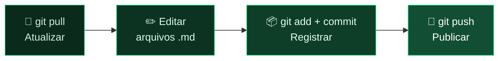

  Curso AltoQi · Produto &amp; Engenharia
  <h1>Documentação como Código</h1>
  
Aprenda a colaborar em documentação de produto usando Git, Markdown, MkDocs e GitHub Copilot — mesmo que você nunca tenha usado Git na vida.

  

    📚 <b>8</b> módulos
    🎯 Nível <b>iniciante</b>
    ⏱️ ~<b>4h</b> de estudo
    💻 Prática guiada no VS Code
  

  

    <a class="cta-btn primary" href="01-git-para-documentacao.html">Começar o curso →</a>
    <a class="cta-btn ghost" href="#modulos">Ver módulos</a>
  

!!! tip "Primeira vez aqui?"
    Este material foi feito para quem **nunca usou Git**. Siga os módulos em ordem — cada um constrói sobre o anterior. Ao final, você vai conseguir colaborar em documentação como um profissional.

Trilha do curso

  <a class="module-card" href="01-git-para-documentacao.html">
    🔀
    Módulo 01
    Git para Documentação
    Repositório, commit, push/pull e o fluxo de trabalho diário — simplificado e completo.
    Iniciar →
  </a>
  <a class="module-card" href="02-vscode-e-copilot.html">
    🧩
    Módulo 02
    VS Code e GitHub Copilot
    Instalação do ambiente, extensões, Git visual e os modos de uso do Copilot no dia a dia.
    Iniciar →
  </a>
  <a class="module-card" href="03-markdown-e-mkdocs.html">
    📝
    Módulo 03
    Markdown e MkDocs
    Sintaxe Markdown, preview local, build/serve do MkDocs, temas e o plugin awesome-pages.
    Iniciar →
  </a>
  <a class="module-card" href="04-branches-e-pull-requests.html">
    🌿
    Módulo 04
    Branches e Pull Requests
    Aprofundamento do fluxo completo: branches isolados, revisão por PR e resolução de conflitos.
    Iniciar →
  </a>
  <a class="module-card" href="05-publicacao-externa.html">
    🌐
    Módulo 05
    Publicando para Acesso Externo
    GitHub Pages, Render.com, Keycloak e CloudOps — como escolher e como atualizar o site.
    Iniciar →
  </a>
  <a class="module-card" href="06-copilot-customizacao.html">
    ⚙️
    Módulo 06
    Personalizando o Copilot
    Instructions, prompts reutilizáveis, agentes e skills para documentação.
    Iniciar →
  </a>
  <a class="module-card extra" href="07-instrucoes-especificas.html">
    ⭐
    Módulo 07
    Instruções Específicas
    Padrões de repositórios reais: Targetprocess, espelhamento de épicos e pasta <code>raw/</code>.
    Iniciar →
  </a>
  <a class="module-card extra" href="08-exercicios-praticos.html">
    🧪
    Módulo 08
    Exercícios Práticos
    Revisão final da trilha com exercícios organizados na mesma ordem dos módulos.
    Praticar →
  </a>

Fluxo de trabalho que você vai dominar

Pré-requisitos

  

    🟧
    
<a href="https://git-scm.com">Git</a><small>controle de versão</small>

  

  

    🐍
    
<a href="https://www.python.org">Python 3.10+</a><small>roda o MkDocs</small>

  

  

    🔷
    
<a href="https://code.visualstudio.com">VS Code</a><small>editor</small>

  

  

    🤖
    
<a href="https://marketplace.visualstudio.com/items?itemName=GitHub.copilot">GitHub Copilot</a><small>extensão do VS Code</small>

  

