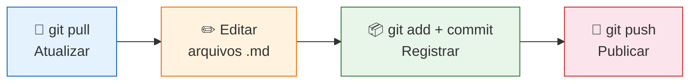

# Documentação como Código

Material de estudo para equipes de Produto e Engenharia trabalharem com documentação de produto usando Git, Markdown, MkDocs e GitHub Copilot.

!!! tip "Primeira vez aqui?"
    Este material foi feito para quem **nunca usou Git**. Siga os módulos em ordem — cada um constrói sobre o anterior. Ao final, você vai conseguir colaborar em documentação como um profissional.

---

## Módulos

| Módulo | Conteúdo |
|---|---|
| [01 — Git para Documentação](01-git-para-documentacao.md) | Repositório, commit, push/pull, fluxo simplificado e completo |
| [02 — Markdown e MkDocs](02-markdown-e-mkdocs.md) | Sintaxe Markdown, MkDocs build/serve, tema, awesome-pages |
| [03 — VS Code e GitHub Copilot](03-vscode-e-copilot.md) | Ambiente, extensões, Git visual, modos do Copilot |
| [04 — Personalizando o Copilot](04-copilot-customizacao.md) | Instructions, prompts, agentes e skills |
| [05 — Branches e Pull Requests](05-branches-e-pull-requests.md) | Aprofundamento do fluxo completo |
| [Módulo Extra — Instruções Específicas](modulo-extra.md) | Padrões de repositórios reais: Targetprocess, espelhamento de épicos, pasta `raw/` |

---

## Fluxo Resumido

---

## Pré-requisitos

| Ferramenta | Link |
|---|---|
| Git | https://git-scm.com |
| Python 3.10+ | https://www.python.org |
| VS Code | https://code.visualstudio.com |
| GitHub Copilot (extensão) | [Marketplace VS Code](https://marketplace.visualstudio.com/items?itemName=GitHub.copilot) |
